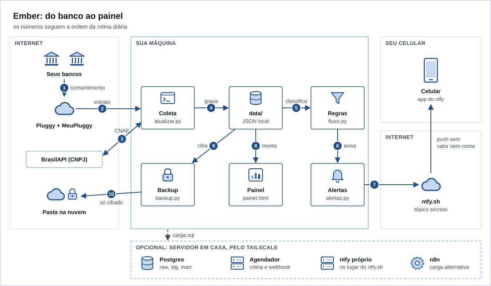

# Ember

Ember é um pipeline de finanças pessoais pra quem tem conta em banco no Brasil. Ele lê o seu extrato e as faturas dos cartões pelo Open Finance (Pluggy, com a conexão feita pelo MeuPluggy), classifica cada transação com regras que você controla, avisa no celular quando algo pede ação e monta um painel HTML que abre no seu navegador. Tudo roda em Python puro, sem dependência instalada, e o seu dado fica em arquivos JSON na sua máquina. Postgres, n8n e um servidor em casa são opcionais.

**Pra quem é.** Pra quem quer ver o próprio dinheiro com regras próprias, sem entregar senha de banco a um app e sem mandar o extrato pra nuvem de ninguém. Você precisa saber rodar um comando no terminal e editar um arquivo JSON. Não é app, não é multiusuário e não dá conselho financeiro.



## Rode a demo em 2 minutos

Só precisa de `python3` (3.10 ou mais novo). Não precisa de conta em lugar nenhum: a demo inventa 12 meses de dois bancos fictícios.

```sh
python3 scripts/gerar_exemplo.py && python3 scripts/atualizar.py --sem-api --sem-push --sem-backup
```

Depois abra `data/painel.html` no navegador.

- `--sem-api` não chama a Pluggy, `--sem-push` não manda nada pro celular, `--sem-backup` não grava backup.
- O gerador escreve uns 570 lançamentos inventados (dois bancos, `banco_a` e `banco_b`, com faturas, contas e status das conexões) e copia os dois modelos de `exemplos/` pra `data/`.
- Ele recusa sobrescrever um `data/` que já tem `transacoes.json`. Use `--forcar` só se esse `data/` for de demo. `--destino PASTA` grava em outro lugar.
- O painel busca o Chart.js no cdnjs e as fontes no Google Fonts. Sem internet, o texto aparece e os gráficos não.


## Plugar o seu

Siga os guias em ordem:

1. [Como funciona](docs/01-como-funciona.md): a arquitetura e as decisões.
2. [Instalar](docs/02-instalar.md): conta na Pluggy, conexão pelo MeuPluggy, `.env`, primeira carga e agendamento.
3. [Regras](docs/03-regras.md): como cada transação ganha tipo e categoria, e como diminuir a zona cinza.
4. [Cadastro manual](docs/04-cadastro-manual.md): o que a API não traz (dívidas, pontos, recebíveis).
5. [Painel](docs/05-painel.md): o que cada seção mostra.
6. [Alertas](docs/06-alertas.md): push pelo ntfy, botões assinados, TickTick opcional.
7. [Servidor em casa](docs/07-servidor-em-casa.md): Docker, Postgres, ntfy próprio, n8n, Tailscale.
8. [Backup](docs/08-backup.md): par de chaves, backup cifrado e restauração.
9. [Segurança](docs/09-seguranca.md): modelo de ameaça e checklist.
10. [Desenvolver](docs/10-desenvolver.md): testes, trava de dado pessoal e como contribuir.

## Segurança, em resumo

- O Ember nunca recebe a senha do seu banco. Na conexão pelo Open Finance, o consentimento acontece no app do banco.
- `data/` e `.env` ficam fora do git e com permissão só pro dono (0600).
- O push não leva valor, nome de loja, de pessoa, de cartão nem de banco. O detalhe fica no painel.
- Nenhuma porta abre pra internet: tudo escuta em `127.0.0.1` ou no IP do Tailscale.
- O backup sai cifrado com a sua chave pública. A privada fica fora da máquina.

Leia [docs/09-seguranca.md](docs/09-seguranca.md) antes de ligar o webhook dos botões. Pra relatar uma falha, veja [SECURITY.md](SECURITY.md).

## Estrutura

```
ember-template/
  assets/              diagramas
  docs/                guias numerados
  exemplos/            modelos de regras e cadastro, com dado inventado
  n8n/                 fluxo opcional de carga no Postgres
  scripts/             a rotina, em Python só com biblioteca padrão
  sql/                 migrations do Postgres opcional
  tests/               unittest, só dado sintético, sem rede
  tools/               trava de dado pessoal
  data/                o seu dado; criado na primeira rodada, fora do git
  .env.example         modelo das variáveis
  docker-compose.yml           Postgres
  docker-compose.ntfy.yml      ntfy próprio
  docker-compose.scripts.yml   rotina diária e webhook num servidor
  Dockerfile.scripts           contêiner dos scripts, sem root
```

## Limitações

O que o Open Finance, pela Pluggy e pelo MeuPluggy, não entrega bem, e como o Ember contorna:

| O que falta | Como fica no Ember |
|---|---|
| Empréstimo e financiamento: nem todo produto de crédito aparece como empréstimo na API, e o Ember não lê essa rota | você registra em `dividas`, no cadastro manual |
| Pontos, milhas e cashback | `pontos`, no cadastro manual |
| Quem deve pra você | `recebiveis`, no cadastro manual |
| Valor da fatura ainda aberta (a API só devolve fatura fechada) | estimado pelas compras, ou `fatura_aberta` lido no app |
| O que já foi pago de cada fatura (vem vazio) | estimado pelos pagamentos no extrato; confirme no app |
| Parcelas da mesma compra não têm chave comum | cada parcela conta no mês da fatura em que cai |
| Histórico: 12 meses só na hora em que a conexão é criada | a base local guarda o que já veio; não existe recarga depois |
| Atualização uma vez por dia | compra estranha pode ser avisada até 24 h depois; o bloqueio na hora é o app do banco |
| Categoria da Pluggy pode mudar ou sumir | as suas regras e as genéricas vêm antes; a categoria da Pluggy é só a penúltima tentativa |

Também não tem: app de celular, login, vários usuários, orçamento por meta ou importação de OFX e CSV.

## Licença

[MIT](LICENSE). Copyright (c) 2026 Ember contributors.
