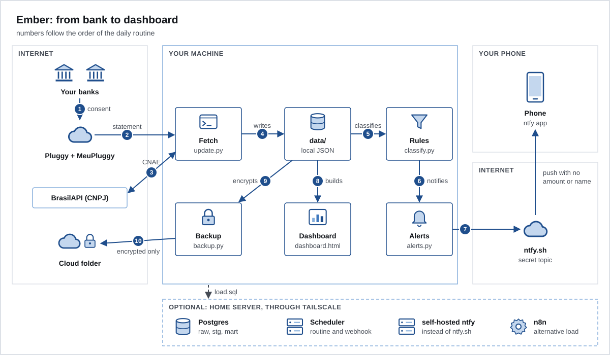
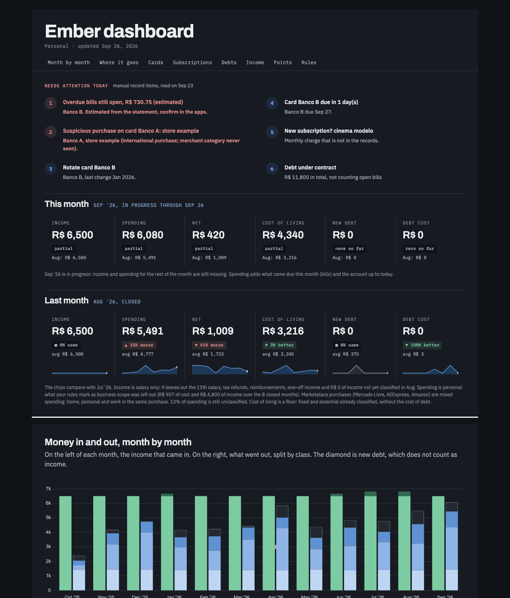

# Ember

This project targets Brazilian bank accounts through Open Finance Brasil (Brazil's open banking standard).

Ember is a personal-finance pipeline for people with bank accounts in Brazil. It reads your statement and your credit card bills through Open Finance, using Pluggy (an Open Finance data aggregator) with the connection made through MeuPluggy (Pluggy's free personal connection app). It classifies each transaction with rules you control, pings your phone when something needs action, and builds an HTML dashboard that opens in your browser. Everything runs in plain Python with no installed dependencies, and your data stays in JSON files on your machine. Postgres, n8n and a home server are optional.

**Who it is for.** People who want to see their own money with their own rules, without giving a bank password to an app and without sending their statement to someone else's cloud. You need to know how to run a command in the terminal and edit a JSON file. It is not an app, it is not multi-user and it does not give financial advice.



## Run the demo in 2 minutes

You only need `python3` (3.10 or newer). You don't need an account anywhere: the demo makes up 12 months of data from two fictional banks.

```sh
python3 scripts/make_demo.py && python3 scripts/update.py --no-api --no-push --no-backup
```

Then open `data/dashboard.html` in your browser.

- `--no-api` does not call Pluggy, `--no-push` sends nothing to your phone, `--no-backup` writes no backup.
- The generator writes about 570 made-up entries (two banks, `banco_a` and `banco_b`, with bills, accounts and connection status) and copies the two templates from `examples/` to `data/`.
- It refuses to overwrite a `data/` that already has `transactions.json`. Use `--force` only if that `data/` holds demo data. `--dest FOLDER` writes somewhere else.
- The dashboard loads Chart.js from cdnjs and the fonts from Google Fonts. Without internet, the text shows up and the charts don't.



## Plug in your own

Follow the guides in order:

1. [How it works](docs/01-how-it-works.md): the architecture and the decisions.
2. [Install](docs/02-install.md): Pluggy account, connection through MeuPluggy, `.env`, first load and scheduling.
3. [Rules](docs/03-rules.md): how each transaction gets a type and a category, and how to shrink the gray zone.
4. [Manual records](docs/04-manual-records.md): what the API doesn't bring (debts, points, receivables).
5. [Dashboard](docs/05-dashboard.md): what each section shows.
6. [Alerts](docs/06-alerts.md): push through ntfy, signed buttons, optional TickTick.
7. [Home server](docs/07-home-server.md): Docker, Postgres, your own ntfy, n8n, Tailscale.
8. [Backup](docs/08-backup.md): key pair, encrypted backup and restore.
9. [Security](docs/09-security.md): threat model and checklist.
10. [Development](docs/10-development.md): tests, personal-data guard and how to contribute.

## Security, in short

- Ember never receives your bank password. With an Open Finance connection, consent happens in your bank's app.
- `data/` and `.env` stay out of git, with owner-only permissions (0600).
- The push carries no amount and no name of a merchant, person, card or bank. The details stay in the dashboard.
- No port opens to the internet: everything listens on `127.0.0.1` or on the Tailscale IP.
- The backup leaves encrypted with your public key. The private key stays off the machine.

Read [docs/09-security.md](docs/09-security.md) before turning on the button webhook. To report a flaw, see [SECURITY.md](SECURITY.md).

## Structure

```
ember-template/
  assets/              diagrams
  docs/                numbered guides
  examples/            rule and records templates, with made-up data
  n8n/                 optional workflow to load into Postgres
  scripts/             the routine, in Python with the standard library only
  sql/                 migrations for the optional Postgres
  tests/               unittest, synthetic data only, no network
  tools/               personal-data guard
  data/                your data; created on the first run, out of git
  .env.example         template for the variables
  docker-compose.yml           Postgres
  docker-compose.ntfy.yml      your own ntfy
  docker-compose.scripts.yml   daily routine and webhook on a server
  Dockerfile.scripts           container for the scripts, no root
```

## Limitations

What Open Finance, through Pluggy and MeuPluggy, doesn't deliver well, and how Ember works around it:

| What's missing | How Ember handles it |
|---|---|
| Loans and financing: not every credit product shows up as a loan in the API, and Ember doesn't read that route | you record it in `debts`, in the manual records |
| Points, miles and cashback | `points`, in the manual records |
| Who owes you | `receivables`, in the manual records |
| Amount of the bill still open (the API only returns closed bills) | estimated from purchases, or `open_bill` read from the app |
| What has already been paid on each bill (comes back empty) | estimated from the payments in the statement; confirm in the app |
| Installments of the same purchase have no common key | each installment counts in the month of the bill it falls on |
| History: 12 months only at the moment the connection is created | the local store keeps what already came in; there is no reload later |
| Updates once a day | a strange purchase may be flagged up to 24 h later; blocking it on the spot is the bank app's job |
| Pluggy's category can change or disappear | your rules and the generic ones come first; Pluggy's category is only the second-to-last attempt |

Also not included: a phone app, login, multiple users, goal-based budgeting, or OFX and CSV import.

## License

[MIT](LICENSE). Copyright (c) 2026 Ember contributors.
