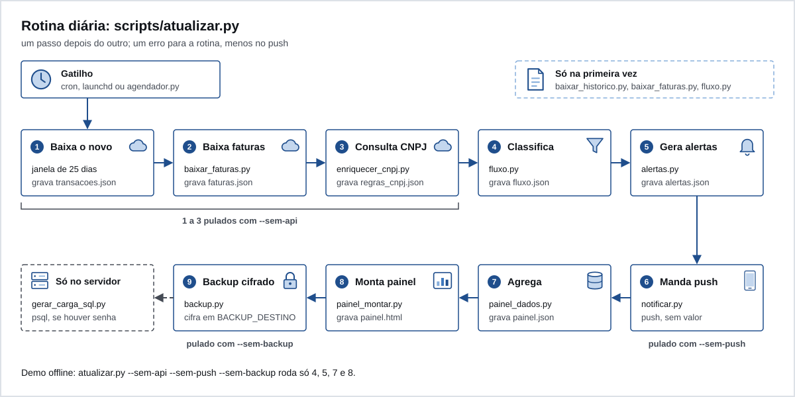

# Instalar

Você vai precisar de:

- `python3` 3.10 ou mais novo;
- `openssl` 3 (só pro backup; no macOS, o `openssl` do sistema é LibreSSL e não serve, veja [08-backup.md](08-backup.md));
- uma conta no MeuPluggy com os seus bancos conectados;
- uma conta no dashboard da Pluggy.

Rode a demo antes (está no [README](../README.md#rode-a-demo-em-2-minutos)). Se ela funcionar, o resto é trocar o dado inventado pelo seu.

## 1. Conectar os bancos no MeuPluggy

1. Crie a sua conta no MeuPluggy e conecte cada banco lá. O consentimento acontece no app do banco.
2. Confira que cada banco aparece como conectado no MeuPluggy.

O MeuPluggy atualiza as conexões uma vez por dia. Rodar o Ember mais vezes que isso não traz dado novo e gasta chamada de API.

## 2. Criar a Application na Pluggy

1. Crie uma conta no [dashboard da Pluggy](https://dashboard.pluggy.ai).
2. Crie uma Application. Ela te dá o `CLIENT_ID` e o `CLIENT_SECRET`.
3. Na personalização do Connect (Customization, no dashboard), habilite o conector **MeuPluggy**.

## 3. Criar uma conexão por banco, pelo conector MeuPluggy

1. Abra o Connect da sua Application (a demo do próprio dashboard serve).
2. No seletor de instituição, escolha **MeuPluggy**. Não escolha o banco direto.
3. Entre com a sua conta do MeuPluggy e autorize o compartilhamento.
4. Repita pra cada banco. Cada autorização cria um Item, e cada Item tem um `itemId` (um UUID).

O que funcionou na prática, e por quê:

- Conectar o banco direto pela Application criou um Item que só durou o período de teste da conta de desenvolvedor. O Item criado pelo conector MeuPluggy espelha a conexão que você já tem no MeuPluggy e continuou funcionando depois do teste. O próprio [README do MeuPluggy](https://github.com/pluggyai/meu-pluggy) diz que os dados continuam acessíveis depois que o teste acaba.
- Escolher o mesmo banco duas vezes na tela de compartilhamento cria Item duplicado. Confira antes de autorizar.
- O MeuPluggy tinha, na época em que o template foi escrito, um limite de 5 conexões ativas.
- Os 12 meses de histórico só vêm na criação da conexão. Depois a API entrega a janela recente. Faça a primeira carga (passo 6) logo depois de conectar.

## 4. Anotar o itemId de cada conexão

Anote o `itemId` na hora em que a conexão termina: o Connect devolve o Item criado, e o `id` dele é o `itemId`. Não conte com achar depois pela API: `GET /items` sem id não lista, e a listagem `GET /v2/items` vem desligada por padrão.

Escolha um rótulo curto pra cada banco: só `a-z`, `0-9` e `_`, até 30 caracteres. Ele vira a `fonte` em tudo: painel, regras, cadastro manual e Postgres. Exemplo: `banco_a`, `banco_b`.

## 5. Preencher o `.env`

```sh
cp .env.example .env
chmod 600 .env
```

Abra o `.env` e preencha. O `.env` está no `.gitignore`. Nunca commite valores reais.

Pras `PLUGGY_*`, `BACKUP_DESTINO` e `BACKUP_CERT`, uma variável de ambiente de mesmo nome ganha do `.env` (útil no contêiner e no CI). As outras são lidas só do `.env`. Exceção: o detector de compra estranha (`suspeitas.py`) lê `EMBER_TZ` só do ambiente.

| Variável | Obrigatória | Pra que serve |
|---|---|---|
| `PLUGGY_CLIENT_ID` | sim | id da sua Application na Pluggy |
| `PLUGGY_CLIENT_SECRET` | sim | segredo da Application |
| `PLUGGY_ITEM_IDS` | sim | conexões a baixar, no formato `rotulo:itemId,rotulo:itemId`. Rótulo `^[a-z0-9_]{1,30}$`, itemId em UUID, sem rótulo repetido. É validado antes de qualquer chamada à API |
| `NTFY_URL` | não | servidor do ntfy. Padrão `https://ntfy.sh` |
| `NTFY_TOPIC` | pro push | tópico onde o push chega. No ntfy.sh público ele é o segredo: longo e aleatório |
| `NTFY_TOKEN` | não | token do seu ntfy próprio, se ele pedir login |
| `NTFY_BIND` | não | interface do ntfy próprio (`docker-compose.ntfy.yml`). Padrão `127.0.0.1`; pro celular alcançar, o IP do servidor no Tailscale. Nunca `0.0.0.0` |
| `NTFY_BASE_URL` | não | URL do ntfy próprio, como o celular enxerga. Só pro `docker-compose.ntfy.yml` |
| `ALERTA_WEBHOOK_TOKEN` | pros botões | 32 caracteres ou mais. No ntfy.sh assina o corpo dos botões (HMAC); no ntfy próprio vai no cabeçalho do webhook. Sem ele o push sai sem botões e o webhook não sobe |
| `ALERTA_WEBHOOK_URL` | não | só com ntfy próprio: o endereço do webhook, `http://<servidor>:8082/alerta` |
| `EMBER_BIND` | não | interface do webhook do agendador. Padrão `127.0.0.1`. Nunca `0.0.0.0` |
| `EMBER_PORTA` | não | porta do webhook. Padrão `8082` |
| `EMBER_HORA` | não | hora da rotina diária no agendador, `HH:MM`. Padrão `09:09` |
| `EMBER_TZ` | não | fuso. Padrão `America/Sao_Paulo`. Vale pro contêiner, pras tarefas do TickTick e pra reconhecer lançamento sem hora |
| `TICKTICK_TOKEN` | não | com ele, o botão "Criar no TickTick" cria a tarefa na hora; sem ele, a tarefa vai pra fila |
| `TICKTICK_PROJECT_ID` | não | lista do TickTick onde a tarefa entra |
| `POSTGRES_PASSWORD` | pro Postgres | senha do Postgres do `docker-compose.yml` e da carga feita pelo agendador |
| `PGHOST` | não | onde o agendador acha o Postgres. Padrão `localhost` |
| `BACKUP_DESTINO` | pro backup | pasta onde os backups cifrados vão. Sem ela, rode com `--sem-backup` |
| `BACKUP_CERT` | não | certificado público do backup. Padrão `scripts/backup_cert.pem`, que não vem no repositório |
| `EMBER_UID`, `EMBER_GID` | não | só no build do contêiner: o dono da pasta montada. Padrão `1000` |

Gere o token dos botões assim:

```sh
python3 -c "import secrets;print(secrets.token_urlsafe(36))"
```

## 6. Primeira carga

Copie os modelos e troque pelo seu dado. O que vai em cada um está em [03-regras.md](03-regras.md) e [04-cadastro-manual.md](04-cadastro-manual.md).

```sh
mkdir -p data && chmod 700 data
cp exemplos/regras_privadas.exemplo.json data/regras_privadas.json
cp exemplos/cadastro_manual.exemplo.json data/cadastro_manual.json
```

Depois, uma vez, nesta ordem:

```sh
python3 scripts/baixar_historico.py   # 12 meses de cada conexão
python3 scripts/baixar_faturas.py     # faturas dos cartões
python3 scripts/fluxo.py              # primeira classificação
python3 scripts/atualizar.py --sem-push --sem-backup
```

O `fluxo.py` vem antes da primeira rotina porque a consulta de CNPJ (`enriquecer_cnpj.py`) olha a zona cinza da rodada anterior. Sem um `data/fluxo.json`, ela para.

Abra `data/painel.html`. Se a zona cinza estiver grande, é esperado: veja [03-regras.md](03-regras.md#diminuir-a-zona-cinza).

## A rotina, passo a passo



`scripts/atualizar.py` roda estes passos, nesta ordem. Um passo com erro para a rotina, menos o push: sem internet, o resto segue.

| # | Script | Grava | Pulado com |
|---|---|---|---|
| 1 | `atualizar.py` (baixa o novo: janela de 25 dias e parcelas futuras, mais o status das conexões) | `transacoes.json`, `contas.json`, `itens.json` | `--sem-api` |
| 2 | `baixar_faturas.py` | `faturas.json` | `--sem-api` |
| 3 | `enriquecer_cnpj.py` (CNAE na BrasilAPI, só CNPJ de empresa) | `cnpj_cache.json`, `regras_cnpj.json` | `--sem-api` |
| 4 | `fluxo.py` | `fluxo.json`, `regras_contraparte.json` | |
| 5 | `alertas.py` | `alertas.json` | |
| 6 | `notificar.py` (push no ntfy) | `alertas_estado.json` | `--sem-push` |
| 7 | `painel_dados.py` | `painel.json` | |
| 8 | `painel_montar.py` | `painel.html` | |
| 9 | `backup.py` | um `.cms` em `BACKUP_DESTINO` | `--sem-backup` |

Tudo que a rotina cria em `data/` nasce só pro dono (`umask 077`).

## 7. Agendar

Rode uma vez por dia, depois do horário em que o MeuPluggy costuma atualizar. Sem `BACKUP_DESTINO`, use `--sem-backup`. Enquanto testa, `--sem-push` evita avisos no celular.

### Linux, com cron

```sh
crontab -e
```

```
9 9 * * * umask 077; cd /caminho/do/ember-template && /usr/bin/python3 scripts/atualizar.py >> data/rotina.log 2>&1
```

O `umask 077` vem antes porque o arquivo de log é criado pelo shell, antes do Python rodar.

### macOS, com launchd

Crie `~/Library/LaunchAgents/local.ember.rotina.plist`:

```xml
<?xml version="1.0" encoding="UTF-8"?>
<!DOCTYPE plist PUBLIC "-//Apple//DTD PLIST 1.0//EN" "http://www.apple.com/DTDs/PropertyList-1.0.dtd">
<plist version="1.0">
<dict>
  <key>Label</key><string>local.ember.rotina</string>
  <key>ProgramArguments</key>
  <array>
    <string>/usr/bin/python3</string>
    <string>/caminho/do/ember-template/scripts/atualizar.py</string>
  </array>
  <key>WorkingDirectory</key><string>/caminho/do/ember-template</string>
  <key>EnvironmentVariables</key>
  <dict>
    <key>PATH</key><string>/opt/homebrew/bin:/usr/local/bin:/usr/bin:/bin</string>
  </dict>
  <key>StartCalendarInterval</key>
  <dict><key>Hour</key><integer>9</integer><key>Minute</key><integer>9</integer></dict>
  <key>Umask</key><integer>63</integer>
  <key>StandardOutPath</key><string>/caminho/do/ember-template/data/rotina.log</string>
  <key>StandardErrorPath</key><string>/caminho/do/ember-template/data/rotina.log</string>
</dict>
</plist>
```

```sh
launchctl bootstrap gui/$(id -u) ~/Library/LaunchAgents/local.ember.rotina.plist
launchctl kickstart gui/$(id -u)/local.ember.rotina   # roda agora, pra testar
```

- `Umask` 63 é o 077 em decimal.
- O `PATH` põe o Homebrew na frente pra o backup achar o OpenSSL 3.
- Se o Mac estiver dormindo no horário, o launchd roda quando ele acordar.
- Pastas como Documentos e Mesa pedem permissão de privacidade ao macOS. Deixe o repositório fora delas, por exemplo em `~/Developer`.

### Num servidor

O contêiner `ember-scripts` tem o próprio agendador, que roda às `EMBER_HORA`. Veja [07-servidor-em-casa.md](07-servidor-em-casa.md).

## Quando algo dá errado

| Sintoma | O que fazer |
|---|---|
| `PLUGGY_ITEM_IDS: rotulo invalido` ou `nao e um UUID` | confira o formato `rotulo:itemId,rotulo:itemId` |
| `Falta data/regras_privadas.json` | copie o modelo de `exemplos/` (passo 6) |
| `data/cadastro_manual.json invalido em ...` | a mensagem aponta o campo; confira o formato em [04-cadastro-manual.md](04-cadastro-manual.md) |
| alerta "Conexão parada" | reconecte o banco no MeuPluggy; sem isso o extrato para de crescer em silêncio |
| `Falta BACKUP_DESTINO` | defina no `.env` ou rode com `--sem-backup` |
| resposta 401 da Pluggy | confira `PLUGGY_CLIENT_ID` e `PLUGGY_CLIENT_SECRET`; a chave de API vale 2 h e o Ember autentica de novo a cada rodada |

Próximo: [03-regras.md](03-regras.md).
