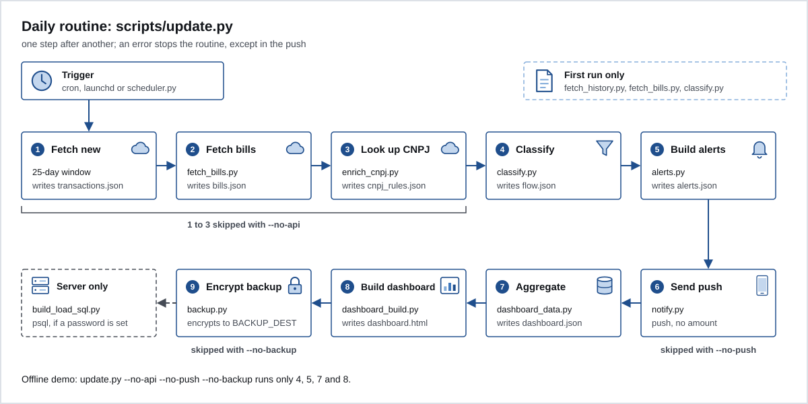

# Install

You will need:

- `python3` 3.10 or newer;
- `openssl` 3 (only for the backup; on macOS, the system `openssl` is LibreSSL and won't work, see [08-backup.md](08-backup.md));
- a MeuPluggy account (Pluggy's free personal connection app) with your banks connected;
- an account on the Pluggy dashboard (Pluggy is an Open Finance data aggregator).

Run the demo first (it's in the [README](../README.md#run-the-demo-in-2-minutes)). If it works, the rest is swapping the made-up data for yours.

## 1. Connect your banks in MeuPluggy

1. Create your MeuPluggy account and connect each bank there. Consent happens in the bank's app.
2. Check that each bank shows as connected in MeuPluggy.

MeuPluggy updates the connections once a day. Running Ember more often than that brings no new data and spends API calls.

## 2. Create the Application in Pluggy

1. Create an account on the [Pluggy dashboard](https://dashboard.pluggy.ai).
2. Create an Application. It gives you the `CLIENT_ID` and the `CLIENT_SECRET`.
3. In the Connect personalization (Customization, in the dashboard), enable the **MeuPluggy** connector.

## 3. Create one connection per bank, through the MeuPluggy connector

1. Open your Application's Connect (the dashboard's own demo works).
2. In the institution picker, choose **MeuPluggy**. Don't choose the bank directly.
3. Sign in with your MeuPluggy account and authorize the sharing.
4. Repeat for each bank. Each authorization creates an Item, and each Item has an `itemId` (a UUID).

What worked in practice, and why:

- Connecting the bank directly through the Application created an Item that only lasted for the developer account's trial period. The Item created through the MeuPluggy connector mirrors the connection you already have in MeuPluggy and kept working after the trial. The [MeuPluggy README](https://github.com/pluggyai/meu-pluggy) itself says the data stays accessible after the trial ends.
- Choosing the same bank twice on the sharing screen creates a duplicate Item. Check before you authorize.
- When this template was written, MeuPluggy had a limit of 5 active connections.
- The 12 months of history only come when the connection is created. After that, the API delivers the recent window. Do the first load (step 6) right after connecting.

## 4. Write down each connection's itemId

Write down the `itemId` as soon as the connection finishes: Connect returns the Item it created, and its `id` is the `itemId`. Don't count on finding it later through the API: `GET /items` without an id doesn't list, and the `GET /v2/items` listing is off by default.

Pick a short label for each bank: only `a-z`, `0-9` and `_`, up to 30 characters. It becomes the `source` everywhere: dashboard, rules, manual records and Postgres. Example: `banco_a`, `banco_b`.

## 5. Fill in `.env`

```sh
cp .env.example .env
chmod 600 .env
```

Open `.env` and fill it in. `.env` is in `.gitignore`. Never commit real values.

For `PLUGGY_*`, `BACKUP_DEST` and `BACKUP_CERT`, an environment variable with the same name wins over `.env` (useful in the container and in CI). The others are read only from `.env`. Exception: the suspicious purchase detector (`suspicious.py`) reads `EMBER_TZ` only from the environment.

| Variable | Required | What it's for |
|---|---|---|
| `PLUGGY_CLIENT_ID` | yes | id of your Pluggy Application |
| `PLUGGY_CLIENT_SECRET` | yes | the Application's secret |
| `PLUGGY_ITEM_IDS` | yes | connections to download, in the format `label:itemId,label:itemId`. Label `^[a-z0-9_]{1,30}$`, itemId as a UUID, no repeated labels. It's validated before any API call |
| `NTFY_URL` | no | ntfy server. Default `https://ntfy.sh` |
| `NTFY_TOPIC` | for push | topic where the push arrives. On public ntfy.sh it is the secret: long and random |
| `NTFY_TOKEN` | no | token for your own ntfy, if it requires login |
| `NTFY_BIND` | no | interface for your own ntfy (`docker-compose.ntfy.yml`). Default `127.0.0.1`; for your phone to reach it, the server's Tailscale IP. Never `0.0.0.0` |
| `NTFY_BASE_URL` | no | URL of your own ntfy, as the phone sees it. Only for `docker-compose.ntfy.yml` |
| `ALERT_WEBHOOK_TOKEN` | for the buttons | 32 characters or more. On ntfy.sh it signs the button body (HMAC); on your own ntfy it goes in the webhook header. Without it the push goes out without buttons and the webhook doesn't start |
| `ALERT_WEBHOOK_URL` | no | only with your own ntfy: the webhook address, `http://<server>:8082/alert` |
| `EMBER_BIND` | no | interface for the scheduler's webhook. Default `127.0.0.1`. Never `0.0.0.0` |
| `EMBER_PORT` | no | webhook port. Default `8082` |
| `EMBER_TIME` | no | time of the daily routine in the scheduler, `HH:MM`. Default `09:09` |
| `EMBER_TZ` | no | time zone. Default `America/Sao_Paulo`. Applies to the container, to TickTick tasks and to recognizing entries with no time |
| `TICKTICK_TOKEN` | no | with it, the "Create in TickTick" button creates the task right away; without it, the task goes to a queue |
| `TICKTICK_PROJECT_ID` | no | TickTick list where the task goes |
| `POSTGRES_PASSWORD` | for Postgres | password for the Postgres in `docker-compose.yml` and for the load done by the scheduler |
| `PGHOST` | no | where the scheduler finds Postgres. Default `localhost` |
| `BACKUP_DEST` | for backup | folder where the encrypted backups go. Without it, run with `--no-backup` |
| `BACKUP_CERT` | no | the backup's public certificate. Default `scripts/backup_cert.pem`, which is not in the repository |
| `EMBER_UID`, `EMBER_GID` | no | only when building the container: owner of the mounted folder. Default `1000` |

Generate the button token like this:

```sh
python3 -c "import secrets;print(secrets.token_urlsafe(36))"
```

## 6. First load

Copy the templates and replace them with your data. What goes in each one is in [03-rules.md](03-rules.md) and [04-manual-records.md](04-manual-records.md).

```sh
mkdir -p data && chmod 700 data
cp examples/private_rules.example.json data/private_rules.json
cp examples/manual_records.example.json data/manual_records.json
```

Then, once, in this order:

```sh
python3 scripts/fetch_history.py   # 12 months from each connection
python3 scripts/fetch_bills.py     # card bills
python3 scripts/classify.py        # first classification
python3 scripts/update.py --no-push --no-backup
```

`classify.py` comes before the first routine because the CNPJ (company taxpayer ID) lookup (`enrich_cnpj.py`) looks at the gray zone from the previous run. Without a `data/flow.json`, it stops.

Open `data/dashboard.html`. If the gray zone is large, that's expected: see [03-rules.md](03-rules.md#shrink-the-gray-zone).

## The routine, step by step



`scripts/update.py` runs these steps, in this order. A step with an error stops the routine, except the push: without internet, the rest goes on.

| # | Script | Writes | Skipped with |
|---|---|---|---|
| 1 | `update.py` (downloads what's new: 25-day window and future installments, plus the connection status) | `transactions.json`, `accounts.json`, `items.json` | `--no-api` |
| 2 | `fetch_bills.py` | `bills.json` | `--no-api` |
| 3 | `enrich_cnpj.py` (CNAE, the national business activity code, from BrasilAPI, a free public API for Brazilian data; company CNPJs only) | `cnpj_cache.json`, `cnpj_rules.json` | `--no-api` |
| 4 | `classify.py` | `flow.json`, `counterparty_rules.json` | |
| 5 | `alerts.py` | `alerts.json` | |
| 6 | `notify.py` (push through ntfy) | `alerts_state.json` | `--no-push` |
| 7 | `dashboard_data.py` | `dashboard.json` | |
| 8 | `dashboard_build.py` | `dashboard.html` | |
| 9 | `backup.py` | a `.cms` in `BACKUP_DEST` | `--no-backup` |

Everything the routine creates in `data/` is born owner-only (`umask 077`).

## 7. Schedule

Run it once a day, after the time MeuPluggy usually updates. Without `BACKUP_DEST`, use `--no-backup`. While testing, `--no-push` avoids notifications on your phone.

### Linux, with cron

```sh
crontab -e
```

```
9 9 * * * umask 077; cd /path/to/ember-template && /usr/bin/python3 scripts/update.py >> data/routine.log 2>&1
```

`umask 077` comes first because the log file is created by the shell, before Python runs.

### macOS, with launchd

Create `~/Library/LaunchAgents/local.ember.routine.plist`:

```xml
<?xml version="1.0" encoding="UTF-8"?>
<!DOCTYPE plist PUBLIC "-//Apple//DTD PLIST 1.0//EN" "http://www.apple.com/DTDs/PropertyList-1.0.dtd">
<plist version="1.0">
<dict>
  <key>Label</key><string>local.ember.routine</string>
  <key>ProgramArguments</key>
  <array>
    <string>/usr/bin/python3</string>
    <string>/path/to/ember-template/scripts/update.py</string>
  </array>
  <key>WorkingDirectory</key><string>/path/to/ember-template</string>
  <key>EnvironmentVariables</key>
  <dict>
    <key>PATH</key><string>/opt/homebrew/bin:/usr/local/bin:/usr/bin:/bin</string>
  </dict>
  <key>StartCalendarInterval</key>
  <dict><key>Hour</key><integer>9</integer><key>Minute</key><integer>9</integer></dict>
  <key>Umask</key><integer>63</integer>
  <key>StandardOutPath</key><string>/path/to/ember-template/data/routine.log</string>
  <key>StandardErrorPath</key><string>/path/to/ember-template/data/routine.log</string>
</dict>
</plist>
```

```sh
launchctl bootstrap gui/$(id -u) ~/Library/LaunchAgents/local.ember.routine.plist
launchctl kickstart gui/$(id -u)/local.ember.routine   # runs now, to test
```

- `Umask` 63 is 077 in decimal.
- The `PATH` puts Homebrew first so the backup finds OpenSSL 3.
- If the Mac is asleep at that time, launchd runs it when it wakes up.
- Folders such as Documents and Desktop require a macOS privacy permission. Keep the repository out of them, for example in `~/Developer`.

### On a server

The `ember-scripts` container has its own scheduler, which runs at `EMBER_TIME`. See [07-home-server.md](07-home-server.md).

## When something goes wrong

| Symptom | What to do |
|---|---|
| `PLUGGY_ITEM_IDS: invalid label` or `is not a UUID` | check the format `label:itemId,label:itemId` |
| `Missing data/private_rules.json` | copy the template from `examples/` (step 6) |
| `data/manual_records.json is invalid at ...` | the message points to the field; check the format in [04-manual-records.md](04-manual-records.md) |
| "Connection stalled" alert | reconnect the bank in MeuPluggy; without that, the statement stops growing in silence |
| `Missing BACKUP_DEST` | set it in `.env` or run with `--no-backup` |
| 401 response from Pluggy | check `PLUGGY_CLIENT_ID` and `PLUGGY_CLIENT_SECRET`; the API key lasts 2 h and Ember authenticates again on every run |

Next: [03-rules.md](03-rules.md).
