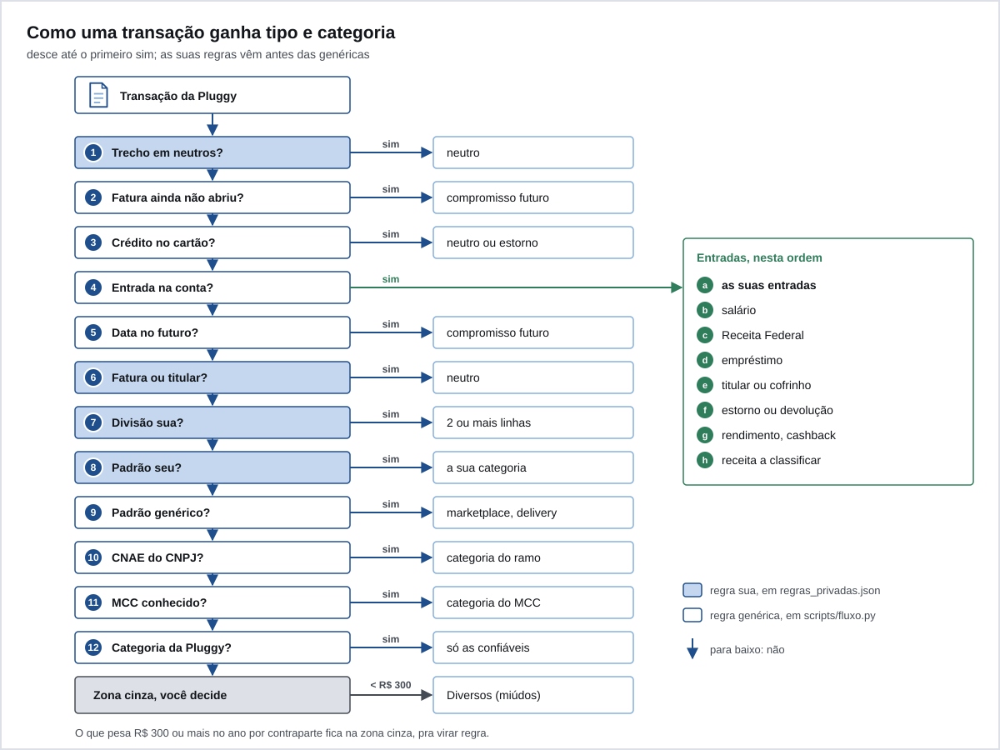

# Regras

O `scripts/fluxo.py` passa cada transação por uma escada de perguntas. A primeira resposta "sim" decide o tipo, a categoria e a essencialidade. As suas regras, em `data/regras_privadas.json`, vêm antes das genéricas. O que nenhuma regra pega com segurança cai na zona cinza, de propósito: é melhor você decidir do que o Ember adivinhar.



## A ordem

1. **Neutros seus.** Trecho de `neutros` na descrição: vira `neutro`.
2. **Parcela futura no cartão.** Compra numa fatura que ainda não abriu: `compromisso_futuro`.
3. **Crédito no cartão.** Pagamento de fatura: `neutro`. Qualquer outro crédito: `estorno`.
4. **Entrada na conta.** Segue uma lista própria, nesta ordem:
   1. as suas `entradas`;
   2. salário: a categoria `Salary` da Pluggy ou a palavra "salario" na descrição;
   3. lote da Receita Federal: `receita_unica`, restituição de IR;
   4. empréstimo caindo na conta: `divida_entrando`;
   5. vindo do titular (documento ou nome) ou do cofrinho: `neutro`;
   6. estorno, reembolso ou devolução: `estorno`;
   7. rendimento e cashback: `receita_unica`;
   8. o resto: "Receita a classificar", na zona cinza.
5. **Saída com data futura.** `compromisso_futuro`.
6. **Pagamento de fatura, quitação antecipada ou transferência pro titular.** Só em conta corrente: `neutro`.
7. **Divisões suas.** A transação vira duas ou mais linhas.
8. **Padrões seus.** Pelo trecho na descrição ou pelo documento do recebedor.
9. **Padrões genéricos.** Marketplace (misto), transporte por app, delivery.
10. **CNAE do CNPJ.** O ramo da empresa, consultado na BrasilAPI.
11. **MCC.** O código de ramo que vem em toda compra no cartão.
12. **Categoria da Pluggy.** Só as confiáveis: mercado, farmácia, saúde, seguro, juros, tarifa, IOF e poucas outras.
13. **Zona cinza.** "A classificar", essencialidade `cinza`.

Depois disso, uma última passada: contraparte na zona cinza que soma menos de R$ 300 no histórico vira "Diversos (miúdos)", com essencialidade `misto`. O que pesa R$ 300 ou mais continua na zona cinza pra você decidir.

Salário de um empregador específico, que não traz a palavra "salario" nem a categoria da Pluggy, vai em `entradas`.

## Onde cada trecho é procurado

Todo `contem` é normalizado: minúsculo, sem acento, espaços juntos. Escrever "Padaria São João" ou "padaria sao joao" dá no mesmo.

- `neutros`: só na descrição.
- `entradas`, `divisoes` e `padroes`: na descrição e no nome da contraparte (quem paga, numa entrada; quem recebe, numa saída).
- `titular.nomes`: na descrição.
- `assinaturas_grupos`: na descrição das saídas.

Quando um `padroes` pega uma transação que traz o documento do recebedor, o Ember guarda esse documento em `data/regras_contraparte.json`. Daí em diante a regra vale pelo documento, mesmo se a descrição mudar.

## O arquivo `data/regras_privadas.json`

Modelo com dado inventado: [`exemplos/regras_privadas.exemplo.json`](../exemplos/regras_privadas.exemplo.json).

| Chave | Tipo | O que é |
|---|---|---|
| `titular.documento` | texto | só dígitos: 11 (CPF) ou 14 (CNPJ), ou vazio. Pagador ou recebedor com esse documento é conta sua |
| `titular.nomes` | lista de texto | o seu nome como aparece no extrato, pra quando a transação não traz documento. Cada um com 4 letras ou mais |
| `neutros` | lista de texto | trechos que sempre viram `neutro` |
| `entradas[]` | lista de objetos | regras pra créditos na conta, antes das genéricas |
| `padroes[]` | lista de objetos | regras pra saídas (conta e cartão) |
| `divisoes[]` | lista de objetos | uma transação vira duas ou mais linhas |
| `assinaturas_grupos[]` | lista de objetos | grupos do gráfico de assinaturas do painel |
| `_comentario` | texto | ignorado |

### `entradas[]`

| Campo | Padrão | Valores |
|---|---|---|
| `contem` | obrigatório | trecho de 3 a 200 caracteres |
| `tipo` | `receita` | `receita`, `receita_unica`, `reembolso`, `divida_entrando`, `neutro`, `estorno` |
| `categoria` | obrigatório | texto livre, como "Salario" |
| `valor_min`, `valor_max` | `null` | faixa de valor; `null` é sem limite |
| `escopo` | `pf` | `pf` ou `pj` |

### `padroes[]`

| Campo | Padrão | Valores |
|---|---|---|
| `contem` | obrigatório | trecho de 3 a 200 caracteres |
| `tipo` | `gasto` | qualquer `tipo_fluxo` |
| `categoria` | obrigatório se `gasto` | texto livre. Use "Grupo, detalhe" ("Moradia, energia") pra o painel juntar pelo grupo |
| `essencialidade` | obrigatória se `gasto` | `fixo_compromissado`, `variavel_essencial`, `discricionario`, `misto`, `cinza` |
| `valor_min`, `valor_max` | `null` | faixa de valor |
| `escopo` | `pf` | `pf` ou `pj` |

### `divisoes[]`

| Campo | Valores |
|---|---|
| `contem`, `valor_min`, `valor_max` | como em `padroes` |
| `partes[]` | 2 ou mais. Cada uma com `proporcao` (número, as proporções somam 1), `tipo` (padrão `gasto`), `categoria`, `essencialidade` (obrigatória se `gasto`) e `escopo` |

### `assinaturas_grupos[]`

| Campo | Padrão | Valores |
|---|---|---|
| `grupo` | obrigatório | nome no gráfico, como "Streaming" |
| `contem` | obrigatório | trecho da descrição |
| `so_valor` | `null` | só conta a cobrança com exatamente esse valor |
| `excluir_valor` | `null` | ignora a cobrança com exatamente esse valor |
| `esporadica` | `false` | `true` pra gasto avulso (cinema, ingresso), mostrado à parte |

### Escopo `pj`

`pj` é empresa ou projeto pago pela conta pessoal. Fica fora da entrada e da saída pessoais e aparece à parte no painel. Use pra separar o que é trabalho sem precisar de outra conta.

### Validação

O arquivo é validado a cada rodada por `validar_regras`, em `scripts/config_privada.py`. Chave desconhecida, tipo errado, texto fora de 3 a 200 caracteres, lista com mais de 2000 itens ou número não finito param tudo, com uma mensagem que aponta o lugar:

```
data/regras_privadas.json invalido em padroes[0].essencialidade: um de fixo_compromissado, variavel_essencial, discricionario, misto, cinza
```

## Exemplo completo

```json
{
  "titular": {"documento": "", "nomes": ["fulana exemplo"]},
  "neutros": ["compra duplicada exemplo"],
  "entradas": [
    {"contem": "empresa exemplo", "tipo": "receita", "categoria": "Salario"},
    {"contem": "comprador exemplo", "tipo": "receita_unica", "categoria": "Venda de equipamento usado", "valor_min": 290, "valor_max": 310}
  ],
  "padroes": [
    {"contem": "energia exemplo", "categoria": "Moradia, energia", "essencialidade": "fixo_compromissado"},
    {"contem": "grafica modelo", "categoria": "Material de trabalho", "essencialidade": "discricionario", "escopo": "pj"}
  ],
  "divisoes": [
    {"contem": "imobiliaria exemplo", "partes": [
      {"proporcao": 0.5, "tipo": "gasto", "categoria": "Moradia, aluguel", "essencialidade": "fixo_compromissado"},
      {"proporcao": 0.5, "tipo": "neutro", "categoria": "Parte de quem divide a casa"}
    ]}
  ],
  "assinaturas_grupos": [
    {"grupo": "Streaming", "contem": "streaming exemplo"},
    {"grupo": "Cinema avulso", "contem": "cinema modelo", "esporadica": true}
  ]
}
```

Com essas regras:

| Transação | Passo | Resultado |
|---|---|---|
| Pix recebido de "EMPRESA EXEMPLO LTDA", R$ 5.000 | 4, entrada sua | `receita`, Salario |
| Pix recebido de "Comprador Exemplo", R$ 300 | 4, entrada sua, dentro da faixa | `receita_unica`, Venda de equipamento usado |
| Pix recebido de "Comprador Exemplo", R$ 900 | 4, fora da faixa, segue a lista | cai nas genéricas e, sem nenhuma, em "Receita a classificar" |
| Pix enviado a "Imobiliária Exemplo", R$ 2.400 | 7, divisão | duas linhas: R$ 1.200 `gasto` aluguel e R$ 1.200 `neutro` |
| Débito "ENERGIA EXEMPLO SA", R$ 180 | 8, padrão seu | `gasto`, Moradia, energia, fixo |
| Cartão "GRAFICA MODELO", R$ 90 | 8, padrão seu | `gasto`, escopo `pj`, fora da saída pessoal |
| Cartão "PADARIA QUALQUER", MCC 5462 | 11, MCC | `gasto`, Alimentação fora, discricionário |

## As regras genéricas

Ficam em `scripts/fluxo.py` e valem pra qualquer pessoa no Brasil. Mexa só se a mudança servir pra todo mundo; o que é seu vai no JSON.

- `PADROES`: marketplace (Mercado Livre, AliExpress, Amazon) como `misto`, porque a mesma compra mistura casa, pessoal e trabalho; transporte por app; delivery.
- `MCC_MAP`: códigos de ramo do cartão pra alimentação, mercado, farmácia, saúde, transporte, combustível, roupa, casa, lazer, educação, viagem, telecom e outros.
- `CNAE` (em `scripts/enriquecer_cnpj.py`): prefixos de 2 ou 4 dígitos do CNAE; o mais específico ganha.
- `MAPA_PLUGGY`: só as categorias da Pluggy em que a essencialidade é certa sem contexto. Transporte, compras e serviços genéricos ficam de fora de propósito: uma corrida pode ser mercado ou lazer.

## A consulta de CNPJ

`enriquecer_cnpj.py` pega os CNPJs de empresa que aparecem na zona cinza, consulta o CNAE na BrasilAPI e grava `data/regras_cnpj.json`. Manda só o CNPJ, que é dado público; CPF nunca sai. O resultado fica em cache em `data/cnpj_cache.json`. Como ele olha a zona cinza da rodada anterior, uma empresa nova ganha categoria na rodada seguinte.

## Diminuir a zona cinza

No começo a zona cinza é grande. Não é falha: é o desenho funcionando. Cada revisão sua vira uma regra, e a zona cinza cai mês a mês.

1. Olhe a seção "Regras, onde estamos" do painel. Ela diz quanto do valor e das linhas está sem regra.
2. Liste o que mais pesa:

   ```sh
   python3 - <<'EOF'
   import json, collections
   soma = collections.Counter()
   for r in json.load(open("data/fluxo.json", encoding="utf-8")):
       if r["tipo_fluxo"] == "gasto" and r["essencialidade"] == "cinza":
           soma[r["descricao"][:40]] += r["valor"]
   for d, v in soma.most_common(20):
       print(f"{v:10.2f}  {d}")
   EOF
   ```

   Isso imprime o seu dado no terminal. Não cole a saída em issue, chat ou print.

3. Pra cada linha que você reconhece, crie um `padroes` (ou `entradas`, ou `divisoes`) com um trecho que só aquela contraparte tem.
4. Rode `python3 scripts/atualizar.py --sem-api --sem-push --sem-backup` e veja o número cair.

Dicas:

- Prefira trecho que identifica a contraparte, não o meio de pagamento. "pix enviado" pega tudo.
- Use `valor_min` e `valor_max` quando a mesma contraparte tem dois papéis (a parcela da venda e um Pix avulso).
- O que é misto de verdade (uma compra de marketplace) pode ficar `misto`. Nem tudo precisa de categoria fina.
- Transporte, compras e serviços genéricos são a zona cinza clássica: só você sabe se a corrida foi pro mercado ou pro bar.

Próximo: [04-cadastro-manual.md](04-cadastro-manual.md).
