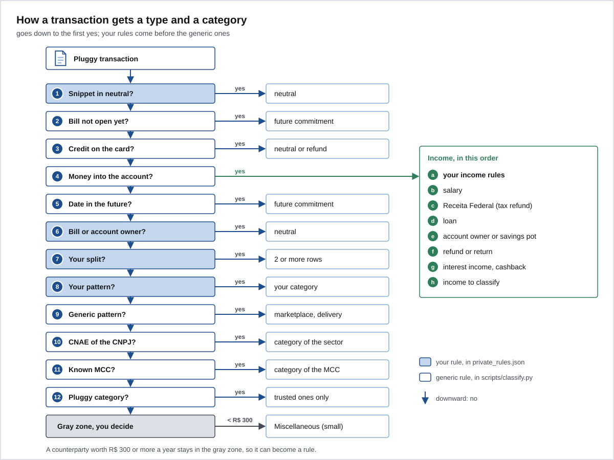

# Rules

`scripts/classify.py` runs each transaction down a ladder of questions. The first "yes" decides the type, the category and the essentiality. Your rules, in `data/private_rules.json`, come before the generic ones. Whatever no rule catches safely falls into the gray zone, on purpose: better that you decide than that Ember guesses.



## The order

1. **Your neutral entries.** A snippet from `neutral` in the description: becomes `neutral`.
2. **Future card installment.** A purchase on a bill that hasn't opened yet: `future_commitment`.
3. **Card credit.** Bill payment: `neutral`. Any other credit: `refund`.
4. **Money coming into the account.** Follows its own list, in this order:
   1. your `income` rules;
   2. salary: Pluggy's `Salary` category or the word "salario" in the description;
   3. a batch from Receita Federal (Brazil's federal tax agency): `one_off_income`, IR (income tax) refund;
   4. a loan landing in the account: `debt_inflow`;
   5. from the account owner (document or name) or from the savings pot: `neutral`;
   6. reversal, reimbursement or return: `refund`;
   7. interest income and cashback: `one_off_income`;
   8. the rest: "Income to classify", in the gray zone.
5. **Money going out with a future date.** `future_commitment`.
6. **Bill payment, early payoff or transfer to the account owner.** Checking account only: `neutral`.
7. **Your splits.** The transaction becomes two or more rows.
8. **Your patterns.** By the snippet in the description or by the payee's document.
9. **Generic patterns.** Marketplace (mixed), ride-hailing, delivery.
10. **CNAE of the CNPJ.** The company's line of business (CNAE, the national business activity code, of the CNPJ, the company taxpayer ID), looked up on BrasilAPI (a free public API for Brazilian data).
11. **MCC.** The merchant category code that comes with every card purchase.
12. **Pluggy category.** Only the reliable ones: groceries, pharmacy, health, insurance, interest, fees, IOF (tax on financial operations) and a few others.
13. **Gray zone.** "To classify", essentiality `gray`.

After that, one last pass: a counterparty in the gray zone that adds up to less than R$ 300 across the history becomes "Miscellaneous (small)", with essentiality `mixed`. Anything that weighs R$ 300 or more stays in the gray zone for you to decide.

Salary from a specific employer that doesn't carry the word "salario" or Pluggy's category goes in `income`.

## Where each snippet is searched

Every `contains` is normalized: lowercase, no accents, spaces collapsed. Writing "Padaria São João" or "padaria sao joao" gives the same result.

- `neutral`: in the description only.
- `income`, `splits` and `patterns`: in the description and in the counterparty name (who pays, for money coming in; who receives, for money going out).
- `owner.names`: in the description.
- `subscription_groups`: in the description of money going out.

When a `patterns` rule catches a transaction that carries the payee's document, Ember stores that document in `data/counterparty_rules.json`. From then on the rule applies by document, even if the description changes.

## The `data/private_rules.json` file

Template with made-up data: [`examples/private_rules.example.json`](../examples/private_rules.example.json).

| Key | Type | What it is |
|---|---|---|
| `owner.document` | text | digits only: 11 (CPF, the individual taxpayer ID) or 14 (CNPJ), or empty. A payer or payee with this document is your own account |
| `owner.names` | list of text | your name as it shows in the statement, for when the transaction carries no document. Each one 4 letters or more |
| `neutral` | list of text | snippets that always become `neutral` |
| `income[]` | list of objects | rules for credits to the account, before the generic ones |
| `patterns[]` | list of objects | rules for money going out (account and card) |
| `splits[]` | list of objects | one transaction becomes two or more rows |
| `subscription_groups[]` | list of objects | groups for the dashboard's subscriptions chart |
| `_comment` | text | ignored |

### `income[]`

| Field | Default | Values |
|---|---|---|
| `contains` | required | snippet of 3 to 200 characters |
| `type` | `income` | `income`, `one_off_income`, `reimbursement`, `debt_inflow`, `neutral`, `refund` |
| `category` | required | free text, such as "Salary" |
| `amount_min`, `amount_max` | `null` | amount range; `null` means no limit |
| `scope` | `personal` | `personal` or `business` |

### `patterns[]`

| Field | Default | Values |
|---|---|---|
| `contains` | required | snippet of 3 to 200 characters |
| `type` | `expense` | any `flow_type` |
| `category` | required if `expense` | free text. Use "Group, detail" ("Housing, electricity") so the dashboard groups by the first part |
| `essentiality` | required if `expense` | `committed_fixed`, `essential_variable`, `discretionary`, `mixed`, `gray` |
| `amount_min`, `amount_max` | `null` | amount range |
| `scope` | `personal` | `personal` or `business` |

### `splits[]`

| Field | Values |
|---|---|
| `contains`, `amount_min`, `amount_max` | as in `patterns` |
| `parts[]` | 2 or more. Each with `share` (a number; the shares add up to 1), `type` (default `expense`), `category`, `essentiality` (required if `expense`) and `scope` |

### `subscription_groups[]`

| Field | Default | Values |
|---|---|---|
| `group` | required | name in the chart, such as "Streaming" |
| `contains` | required | snippet of the description |
| `only_amount` | `null` | only counts the charge with exactly this amount |
| `exclude_amount` | `null` | ignores the charge with exactly this amount |
| `sporadic` | `false` | `true` for one-off spending (cinema, tickets), shown separately |

### `business` scope

`business` is a company or project paid from the personal account. It stays out of personal income and spending and shows up separately on the dashboard. Use it to separate work from personal without needing another account.

### Validation

The file is validated on every run by `validate_rules`, in `scripts/private_config.py`. An unknown key, a wrong type, text outside 3 to 200 characters, a list with more than 2000 items or a non-finite number stops everything, with a message that points to the spot:

```
data/private_rules.json is invalid at patterns[0].essentiality: one of committed_fixed, essential_variable, discretionary, mixed, gray
```

## Full example

```json
{
  "owner": {"document": "", "names": ["fulana exemplo"]},
  "neutral": ["compra duplicada exemplo"],
  "income": [
    {"contains": "empresa exemplo", "type": "income", "category": "Salary"},
    {"contains": "comprador exemplo", "type": "one_off_income", "category": "Used equipment sale", "amount_min": 290, "amount_max": 310}
  ],
  "patterns": [
    {"contains": "energia exemplo", "category": "Housing, electricity", "essentiality": "committed_fixed"},
    {"contains": "grafica modelo", "category": "Work supplies", "essentiality": "discretionary", "scope": "business"}
  ],
  "splits": [
    {"contains": "imobiliaria exemplo", "parts": [
      {"share": 0.5, "type": "expense", "category": "Housing, rent", "essentiality": "committed_fixed"},
      {"share": 0.5, "type": "neutral", "category": "Housemate's share"}
    ]}
  ],
  "subscription_groups": [
    {"group": "Streaming", "contains": "streaming exemplo"},
    {"group": "One-off cinema", "contains": "cinema modelo", "sporadic": true}
  ]
}
```

With these rules:

| Transaction | Step | Result |
|---|---|---|
| Pix (Brazil's instant payment system) received from "EMPRESA EXEMPLO LTDA", R$ 5,000 | 4, your income rule | `income`, Salary |
| Pix received from "Comprador Exemplo", R$ 300 | 4, your income rule, inside the range | `one_off_income`, Used equipment sale |
| Pix received from "Comprador Exemplo", R$ 900 | 4, outside the range, continues down the list | falls to the generic rules and, with none matching, into "Income to classify" |
| Pix sent to "Imobiliária Exemplo", R$ 2,400 | 7, split | two rows: R$ 1,200 `expense` rent and R$ 1,200 `neutral` |
| Debit "ENERGIA EXEMPLO SA", R$ 180 | 8, your pattern | `expense`, Housing, electricity, committed fixed |
| Card "GRAFICA MODELO", R$ 90 | 8, your pattern | `expense`, scope `business`, out of personal spending |
| Card "PADARIA QUALQUER", MCC 5462 | 11, MCC | `expense`, Eating out, discretionary |

## The generic rules

They live in `scripts/classify.py` and apply to anyone in Brazil. Only change them if the change works for everyone; what's yours goes in the JSON.

- `PATTERNS`: marketplaces (Mercado Livre, AliExpress, Amazon) as `mixed`, because the same purchase mixes home, personal and work; ride-hailing; delivery.
- `MCC_MAP`: card merchant category codes for food, groceries, pharmacy, health, transport, fuel, clothing, home, leisure, education, travel, phone and others.
- `CNAE` (in `scripts/enrich_cnpj.py`): 2- or 4-digit CNAE prefixes; the most specific one wins.
- `PLUGGY_MAP`: only the Pluggy categories where the essentiality is certain without context. Transport, shopping and generic services are left out on purpose: a ride could be to the grocery store or to a night out.

## The CNPJ lookup

`enrich_cnpj.py` takes the company CNPJs that show up in the gray zone, looks up the CNAE on BrasilAPI and writes `data/cnpj_rules.json`. It sends only the CNPJ, which is public data; a CPF never leaves. The result is cached in `data/cnpj_cache.json`. Since it looks at the gray zone from the previous run, a new company gets its category on the following run.

## Shrink the gray zone

At the start the gray zone is large. That's not a failure: it's the design working. Each review you do becomes a rule, and the gray zone drops month by month.

1. Look at the "Rules, where things stand" section of the dashboard. It tells you how much of the amount and of the rows has no rule.
2. List what weighs the most:

   ```sh
   python3 - <<'EOF'
   import json, collections
   total = collections.Counter()
   for r in json.load(open("data/flow.json", encoding="utf-8")):
       if r["flow_type"] == "expense" and r["essentiality"] == "gray":
           total[r["description"][:40]] += r["amount"]
   for d, v in total.most_common(20):
       print(f"{v:10.2f}  {d}")
   EOF
   ```

   This prints your data in the terminal. Don't paste the output into an issue, a chat or a screenshot.

3. For each row you recognize, create a `patterns` rule (or `income`, or `splits`) with a snippet only that counterparty has.
4. Run `python3 scripts/update.py --no-api --no-push --no-backup` and watch the number drop.

Tips:

- Prefer a snippet that identifies the counterparty, not the payment method. "pix enviado" catches everything.
- Use `amount_min` and `amount_max` when the same counterparty plays two roles (the installment of a sale and a one-off Pix).
- What is truly mixed (a marketplace purchase) can stay `mixed`. Not everything needs a fine-grained category.
- Transport, shopping and generic services are the classic gray zone: only you know whether the ride was to the grocery store or to the bar.

Next: [04-manual-records.md](04-manual-records.md).
