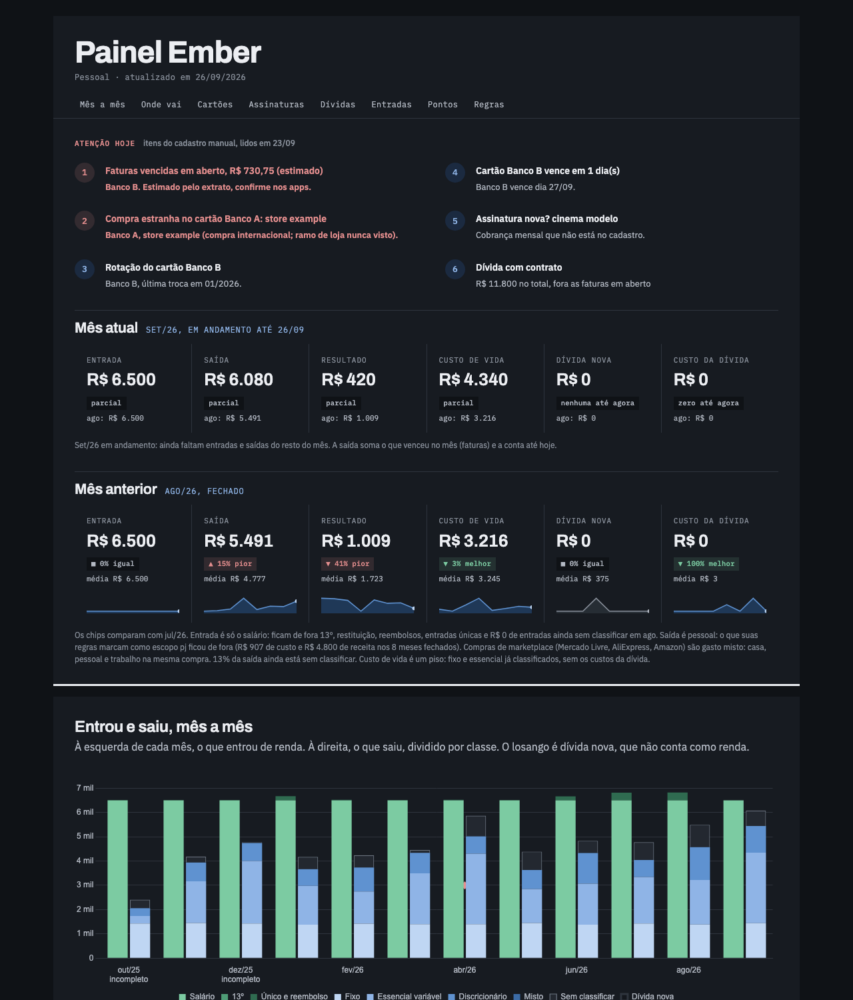

# Painel

O painel é um arquivo só, `data/painel.html`, que abre direto no navegador. Não tem servidor, login nem banco de dados. Ele segue o tema claro ou escuro do sistema.



## O que cada seção mostra

| Seção | O que mostra |
|---|---|
| Atenção hoje | os 5 primeiros alertas, do vencido pro informativo, e o total das dívidas com contrato |
| Mês atual | entrada, saída, resultado, custo de vida, dívida nova e custo da dívida até hoje, comparados com o mês anterior |
| Mês anterior | os mesmos números do último mês fechado, com a média dos meses fechados e uma linha de tendência |
| Mês a mês | o que entrou e o que saiu em cada mês, a saída dividida por essencialidade; a dívida nova aparece à parte, porque não é renda |
| Onde o dinheiro vai | o gasto por essencialidade e as 10 categorias maiores, em média por mês fechado; aluguel e energia num mês típico |
| Cartões | as últimas faturas de cada cartão, a fatura aberta (do app ou estimada) e as parcelas já contratadas pros próximos meses |
| Assinaturas | custo por mês, por grupo de `assinaturas_grupos`, e a lista do que está cobrando, do cadastro manual |
| Dívidas | quanto já foi pago e quanto falta de cada dívida, mais a dívida nova e o custo da dívida por mês |
| Entradas que ainda vêm | recebíveis e rendimento da conta |
| Pontos, milhas e bônus | valor estimado por programa e o que expira primeiro |
| Regras, onde estamos | quanto do valor e das linhas ainda está na zona cinza, e o que já é feito por regra |

Como ler os números:

- "Entrada" é só o salário. 13º, restituição, reembolso e entradas únicas ficam de fora, pra média não inflar.
- "Saída" é pessoal. O que as suas regras marcam com escopo `pj` aparece numa nota à parte.
- "Custo de vida" é um piso: fixo e essencial já classificados, sem custo de dívida.
- Os 3 primeiros meses do histórico contam como incompletos (os cartões demoram a aparecer). O mês atual é parcial. As médias usam só os meses fechados.
- Os valores estimados (fatura aberta, fatura vencida em aberto) dizem que são estimados. Confirme no app.

## Como é gerado

1. `scripts/painel_dados.py` lê `fluxo.json`, `faturas.json`, `transacoes.json`, `alertas.json` e os seus dois JSON pessoais, e grava `data/painel.json` com os números já agregados.
2. `scripts/painel_montar.py` injeta esse JSON em `scripts/painel_template.html` e grava `data/painel.html`.

Na montagem:

- O JSON entra dentro do único script inline da página, com `</` escapado pra não fechar a tag antes da hora.
- O Ember calcula o SHA-256 desse script e põe o hash na Content Security Policy da página. A CSP libera só esse script e o Chart.js do cdnjs. Não existe `'unsafe-inline'` pra script.
- O Chart.js vem com Subresource Integrity (`integrity="sha384-..."`): se o arquivo no cdnjs mudar, o navegador recusa.
- A CSP também bloqueia qualquer conexão de rede da página (`connect-src 'none'`), formulário e `<base>`.
- Todo texto que vem de fora (descrição de alerta, nome no cadastro, regra) passa por uma função de escape antes de entrar no HTML.

Pra mudar o visual, edite `scripts/painel_template.html` e rode de novo:

```sh
python3 scripts/atualizar.py --sem-api --sem-push --sem-backup
```

Se você trocar a versão do Chart.js, troque também a URL na CSP e o `integrity`.

## Nunca publique o painel

`data/painel.html` tem o seu dado financeiro inteiro dentro dele. Ele está em `data/`, que o `.gitignore` já ignora.

- Não commite, nem com `git add -f`.
- Não suba pra GitHub Pages, Netlify, Drive público, pastebin ou chat.
- Não sirva por um servidor HTTP aberto na rede. Abra como arquivo.
- Pra mostrar o painel a alguém, gere a demo (`gerar_exemplo.py`) numa cópia separada do repositório.

Próximo: [06-alertas.md](06-alertas.md).
