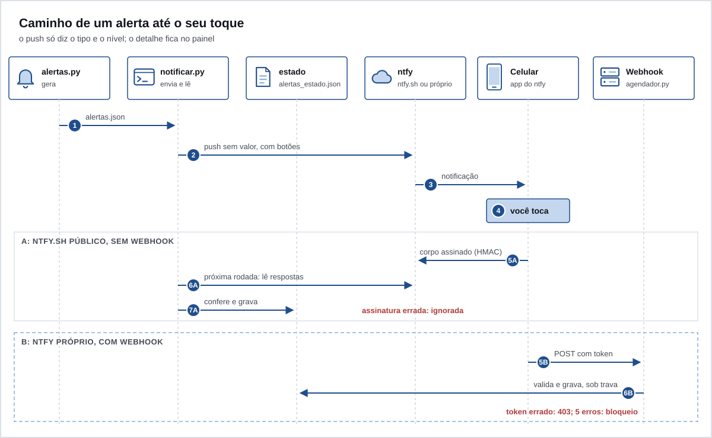

# Alertas

`scripts/alertas.py` olha o seu dado e grava `data/alertas.json`. `scripts/notificar.py` manda pro celular, pelo ntfy, o que pede ação. O resto fica só no painel.



## Tipos de alerta

| Alerta | Quando | Nível | Vira push |
|---|---|---|---|
| Fatura vencida em aberto | fatura dos últimos 60 dias com saldo acima de R$ 20 e de 5% do total, pelo que o extrato mostra de pagamento | vencido | sim |
| Cartão vencendo | vencimento em até 3 dias sem o mínimo pago; se a fatura ainda não fechou na API, o vencimento é projetado | atenção | sim |
| Limite comprometido | 90% ou mais do limite em uso, pelo que a Pluggy informa | atenção | sim |
| Assinatura sem cobrança | assinatura mensal do cadastro sem cobrança há mais de 40 dias | atenção | sim |
| Assinatura nova? | cobrança de valor estável em 3 meses seguidos, fora da lista | atenção | sim |
| Recebível atrasado | a parcela do mês ainda não caiu, passado o dia de costume | atenção | sim |
| Nota fiscal faltando | nos 120 dias antes do prazo do IR | atenção | sim |
| Rotação do cartão | 6 meses depois de `ultima_rotacao` | atenção | sim |
| Compra estranha | veja abaixo | vencido | sim |
| Dívida vencendo | `proxima` em até 10 dias | atenção | sim |
| Pontos vencendo | expiram em até 30 dias (atenção) ou em 31 a 60 (informativo) | atenção ou info | só atenção |
| Conexão parada | status diferente de atualizado, erro na última execução, ou 3 dias sem atualizar | vencido | sim |
| Fatura fechando | fechamento em até 7 dias, com `fatura_aberta` no cadastro | atenção | não, só painel |
| Melhor cartão pra comprar hoje | o que dá mais dias até pagar, com limite livre | info | não, só painel |
| Cadastro desatualizado | `lido_em` com mais de 30 dias | info | não, só painel |

Regras do envio:

- Vencido é reenviado a cada 3 dias; atenção, a cada 7. Informativo nunca vira push.
- Avisos parecidos (várias dívidas, vários cartões vencendo, vários limites, várias assinaturas, várias rotações) viram um push só.
- Cada alerta tem uma chave estável, como `minimo-banco_a-2026-10-05`. É por ela que o Ember sabe o que já avisou e o que você ignorou.

### Compra estranha

`scripts/suspeitas.py` olha as compras no cartão dos últimos 3 dias e compara com o seu próprio histórico, sem valor fixo. Só começa a avisar com 200 compras ou mais no histórico. Os sinais:

| Sinal | Quando |
|---|---|
| compra internacional | moeda diferente de real, ou país no fim da descrição diferente de Brasil |
| ramo de loja nunca visto | MCC que nunca apareceu antes, em compra de R$ 50 ou mais |
| comerciante novo com valor alto | acima do percentil 95 do histórico e de R$ 300 |
| várias compras em poucos minutos | 3 comerciantes diferentes em até 10 minutos |

Cidade não conta: compra online costuma vir com a cidade da sede da loja. Esse push tem dois botões: "Fui eu" ensina o Ember (o ramo e o comerciante deixam de contar como novos) e "Não fui eu" vira tarefa urgente. A Pluggy atualiza uma vez por dia, então o aviso pode chegar até 24 h depois. O bloqueio na hora é no app do banco.

## O que o push diz

Só o tipo do alerta, quantos são e o nível. Exemplo: "Ember: cartão vencendo. 1 alerta de atenção, confira o painel." Nunca leva valor, nome de loja, de pessoa, de cartão ou de banco, porque passa pelo servidor do ntfy e aparece na tela bloqueada. O detalhe fica no painel.

## Os botões

| Botão | Efeito |
|---|---|
| Lembrar amanhã | adia o alerta por 1 dia |
| Ignorar | para de cobrar aquele alerta |
| Criar no TickTick | cria a tarefa (ou põe na fila) e para de cobrar |

A resposta só vale pra uma chave que existe em `data/alertas.json`, no formato `[a-z0-9_-]`, com no máximo 20 chaves por toque. O estado fica em `data/alertas_estado.json`, gravado de forma atômica (arquivo temporário e troca) e sob trava de arquivo, porque o agendador e o `notificar.py` escrevem nele.

## ntfy.sh público ou ntfy próprio

### ntfy.sh público (padrão)

- Instale o app do ntfy no celular e assine o seu `NTFY_TOPIC`.
- O tópico é o segredo: quem souber o nome lê os pushes. Use um nome longo e aleatório.
- Os botões postam num segundo tópico, `<NTFY_TOPIC>-resposta`. Qualquer um que saiba esse nome consegue postar nele. Por isso, com o ntfy.sh, o corpo de cada botão leva uma assinatura HMAC-SHA256 feita com `ALERTA_WEBHOOK_TOKEN`: `acao:chave:assinatura`. Resposta sem assinatura válida é ignorada.
- O token em si nunca vai pro ntfy.sh. Só a assinatura de cada ação.
- As respostas são lidas na rodada seguinte do `notificar.py`. Até lá, o toque não tem efeito.
- Sem `ALERTA_WEBHOOK_TOKEN` com 32 caracteres ou mais, o push sai sem botões e as respostas não são lidas.
- Uma assinatura capturada só repete a mesma ação na mesma chave. Ignorar duas vezes dá no mesmo.
- O ntfy.sh vê metadados: a hora de cada push, o nome do tópico e o seu IP.

### ntfy próprio

Suba o `docker-compose.ntfy.yml` num servidor seu (veja [07-servidor-em-casa.md](07-servidor-em-casa.md)) e troque `NTFY_URL`. Ele nasce com `NTFY_AUTH_DEFAULT_ACCESS: deny-all`: só entra quem tem login ou token (`NTFY_TOKEN`).

- Com `ALERTA_WEBHOOK_URL`, os botões chamam direto o webhook do `agendador.py`, com `ALERTA_WEBHOOK_TOKEN` no cabeçalho `Authorization`. O toque vale na hora.
- Sem `ALERTA_WEBHOOK_URL`, os botões postam no tópico de resposta do seu ntfy, com `NTFY_TOKEN`, e valem na rodada seguinte.
- Em qualquer dos dois, o token vai dentro da mensagem que chega ao celular. Por isso esse modo só existe com ntfy próprio: com o ntfy.sh, o Ember ignora `ALERTA_WEBHOOK_URL` e avisa.
- No iPhone, o push da Apple passa por um servidor central. O compose liga `NTFY_UPSTREAM_BASE_URL=https://ntfy.sh`, que manda pra lá só o id da mensagem, não o texto.

## O webhook dos botões

É um servidor HTTP mínimo dentro do `agendador.py`. Ele só sobe se todos estes itens valerem:

- `ALERTA_WEBHOOK_TOKEN` com 32 caracteres ou mais. Sem ele, o agendador loga erro e roda só a rotina diária.
- Escuta em `EMBER_BIND`, padrão `127.0.0.1`. Pro celular alcançar, o IP do servidor no Tailscale. Nunca `0.0.0.0`.

O que ele aceita:

- só `POST /alerta`, com `Authorization: Bearer <token>`, comparado em tempo constante;
- `Content-Length` obrigatório, até 256 bytes (411 ou 413 se não);
- 5 segundos por conexão, um pedido por vez;
- IP que erra o token 5 vezes fica bloqueado 1 minuto (429). Cada nova rodada de erros dobra o bloqueio, até 1 hora;
- resposta sem detalhe, e o log não guarda o corpo do pedido.

O checklist antes de ligar está em [09-seguranca.md](09-seguranca.md#antes-de-ligar-o-webhook).

## TickTick, opcional

- Com `TICKTICK_TOKEN` (e `TICKTICK_PROJECT_ID`, se quiser uma lista específica), o webhook cria a tarefa na hora pela API aberta do TickTick. Essa parte está marcada no código como não testada.
- Sem token, ou se a API falhar, a tarefa fica na fila. Pra ver e registrar:

```sh
python3 scripts/notificar.py --pendentes             # o que falta criar
python3 scripts/notificar.py --criada CHAVE ID       # registra a tarefa criada à mão
```

## Comandos úteis

```sh
python3 scripts/notificar.py --dry-run    # mostra o que mandaria, sem mandar
python3 scripts/notificar.py --teste      # manda um push de teste
python3 scripts/notificar.py --respostas  # só lê os toques pendentes
```

Próximo: [07-servidor-em-casa.md](07-servidor-em-casa.md).
