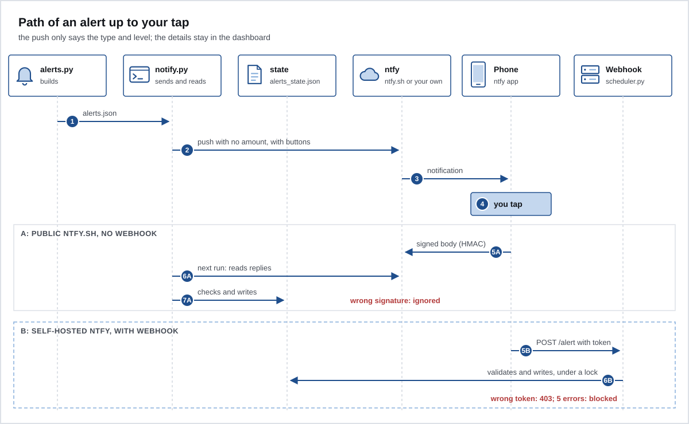

# Alerts

`scripts/alerts.py` looks at your data and writes `data/alerts.json`. `scripts/notify.py` sends whatever needs action to your phone, through ntfy. Everything else stays on the dashboard.



## Alert types

| Alert | When | Level | Becomes a push |
|---|---|---|---|
| Overdue open bill | a bill from the last 60 days with a balance above R$ 20 and above 5% of the total, based on the payments the statement shows | overdue | yes |
| Card due soon | due in 3 days or less with the minimum unpaid; if the bill has not closed in the API yet, the due date is projected | warning | yes |
| Limit nearly used | 90% or more of the limit in use, as reported by Pluggy (Open Finance data aggregator) | warning | yes |
| Subscription not charged | a monthly subscription from your manual records with no charge for more than 40 days | warning | yes |
| New subscription? | a charge with a stable amount for 3 months in a row, not on the list | warning | yes |
| Late receivable | this month's installment has not arrived, past the usual day | warning | yes |
| Missing receipt | in the 120 days before the IR (income tax) deadline | warning | yes |
| Card rotation | 6 months after `last_rotation` | warning | yes |
| Suspicious purchase | see below | overdue | yes |
| Debt due soon | `next_due` within 10 days | warning | yes |
| Points expiring | expire within 30 days (warning) or within 31 to 60 days (info) | warning or info | warning only |
| Connection stalled | status other than updated, an error on the last run, or 3 days without an update | overdue | yes |
| Bill closing | closing date within 7 days, with `open_bill` in your manual records | warning | no, dashboard only |
| Best card to buy with today | the one that gives you the most days until payment, with free limit | info | no, dashboard only |
| Stale manual records | `read_on` older than 30 days | info | no, dashboard only |

Sending rules:

- Overdue alerts are sent again every 3 days; warnings, every 7. Info never becomes a push.
- Similar alerts (several debts, several cards due, several limits, several subscriptions, several rotations) become a single push.
- Each alert has a stable key, like `minimum-banco_a-2026-10-05`. Ember uses it to know what it already sent and what you ignored.

### Suspicious purchase

`scripts/suspicious.py` looks at card purchases from the last 3 days and compares them with your own history, with no fixed amount. It only starts alerting once the history has 200 purchases or more. The signals:

| Signal | When |
|---|---|
| international purchase | currency other than the real, or a country at the end of the description other than Brazil |
| merchant category never seen | an MCC that never appeared before, on a purchase of R$ 50 or more |
| new merchant with a high amount | above the 95th percentile of your history and above R$ 300 |
| several purchases within minutes | 3 different merchants within 10 minutes |

City does not count: online purchases often carry the city of the store's headquarters. This push has two buttons: "It was me" teaches Ember (the category and the merchant stop counting as new) and "Not me" becomes an urgent task. Pluggy updates once a day, so the alert can arrive up to 24 h later. To block the card right away, use your bank's app.

## What the push says

Only the alert type, how many there are, and the level. Example: "Ember: card due soon. 1 warning alert, check the dashboard." It never carries an amount, or the name of a store, person, card or bank, because it goes through the ntfy server and shows on the lock screen. The details stay on the dashboard.

## The buttons

| Button | Effect |
|---|---|
| Remind me tomorrow | snoozes the alert for 1 day |
| Ignore | stops reminding you about that alert |
| Create in TickTick | creates the task (or queues it) and stops reminding you |

A reply only counts for a key that exists in `data/alerts.json`, in the format `[a-z0-9_-]`, with at most 20 keys per tap. The state lives in `data/alerts_state.json`. It is written atomically (temporary file, then swap) and under a file lock, because both the scheduler and `notify.py` write to it.

## Public ntfy.sh or your own ntfy

### Public ntfy.sh (default)

- Install the ntfy app on your phone and subscribe to your `NTFY_TOPIC`.
- The topic is the secret: anyone who knows the name can read the pushes. Use a long, random name.
- The buttons post to a second topic, `<NTFY_TOPIC>-reply`. Anyone who knows that name can post to it. That is why, with ntfy.sh, the body of each button carries an HMAC-SHA256 signature made with `ALERT_WEBHOOK_TOKEN`: `action:key:signature`. A reply without a valid signature is ignored.
- The token itself never goes to ntfy.sh. Only the signature of each action does.
- Replies are read on the next run of `notify.py`. Until then, the tap has no effect.
- Without an `ALERT_WEBHOOK_TOKEN` of 32 characters or more, the push goes out without buttons and replies are not read.
- A captured signature can only repeat the same action on the same key. Ignoring twice has the same result.
- ntfy.sh sees metadata: the time of each push, the topic name and your IP.

### Your own ntfy

Run `docker-compose.ntfy.yml` on a server of your own (see [07-home-server.md](07-home-server.md)) and change `NTFY_URL`. It starts with `NTFY_AUTH_DEFAULT_ACCESS: deny-all`: only someone with a login or token (`NTFY_TOKEN`) gets in.

- With `ALERT_WEBHOOK_URL`, the buttons call the `scheduler.py` webhook directly, with `ALERT_WEBHOOK_TOKEN` in the `Authorization` header. The tap takes effect right away.
- Without `ALERT_WEBHOOK_URL`, the buttons post to the reply topic on your ntfy, with `NTFY_TOKEN`, and take effect on the next run.
- In both cases, the token travels inside the message that reaches your phone. That is why this mode only exists with your own ntfy: with ntfy.sh, Ember ignores `ALERT_WEBHOOK_URL` and warns you.
- On iPhone, Apple's push goes through a central server. The compose file sets `NTFY_UPSTREAM_BASE_URL=https://ntfy.sh`, which sends only the message id there, not the text.

## The button webhook

It is a minimal HTTP server inside `scheduler.py`. It only starts if all of these hold:

- `ALERT_WEBHOOK_TOKEN` has 32 characters or more. Without it, the scheduler logs an error and runs only the daily routine.
- It listens on `EMBER_BIND`, default `127.0.0.1`. For your phone to reach it, use the server's Tailscale IP. Never `0.0.0.0`.

What it accepts:

- only `POST /alert`, with `Authorization: Bearer <token>`, compared in constant time;
- `Content-Length` is required, up to 256 bytes (411 or 413 otherwise);
- 5 seconds per connection, one request at a time;
- an IP that gets the token wrong 5 times is blocked for 1 minute (429). Each new round of failures doubles the block, up to 1 hour;
- responses carry no detail, and the log does not keep the request body.

The checklist before you turn it on is in [09-security.md](09-security.md#before-you-turn-on-the-webhook).

## TickTick, optional

- With `TICKTICK_TOKEN` (and `TICKTICK_PROJECT_ID`, if you want a specific list), the webhook creates the task right away through TickTick's open API. This part is marked as untested in the code.
- Without a token, or if the API fails, the task goes to a queue. To see and record it:

```sh
python3 scripts/notify.py --pending              # what is left to create
python3 scripts/notify.py --created KEY ID       # records a task you created by hand
```

## Useful commands

```sh
python3 scripts/notify.py --dry-run    # shows what it would send, without sending
python3 scripts/notify.py --test       # sends a test push
python3 scripts/notify.py --replies    # only reads pending taps
```

Next: [07-home-server.md](07-home-server.md).
