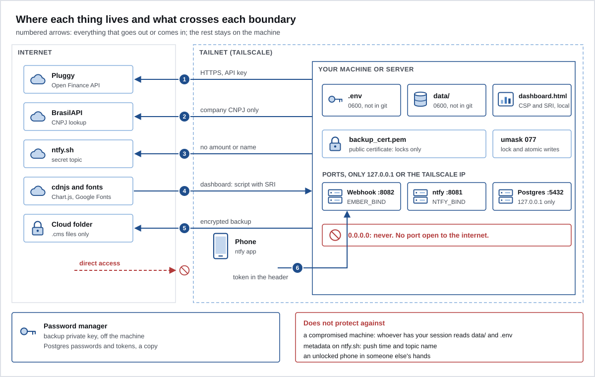

# Security

Ember handles your entire bank statement. This page says where each thing lives, what crosses each boundary, what is protected and what is not.



## The zones

| Zone | What it holds | Who you trust |
|---|---|---|
| Internet | Pluggy (Open Finance data aggregator), BrasilAPI (free public API for Brazilian data), ntfy.sh, cdnjs, Google Fonts, the backup folder in the cloud | each service, only for what it needs to see |
| Tailnet (Tailscale) | your phone and the home server | your devices and your Tailscale account |
| Your machine or server | `.env`, `data/`, `dashboard.html`, the backup certificate, the local ports | your system user |
| Outside everything | the backup private key, in your password manager | the password manager |

## What leaves the machine, and where it goes

| # | Destination | What goes | What does not go |
|---|---|---|---|
| 1 | Pluggy | HTTPS with the `CLIENT_ID` and `CLIENT_SECRET`, the itemIds | nothing else of yours; the statement comes from there |
| 2 | BrasilAPI | the CNPJ (company taxpayer ID) of companies in your gray zone | CPF (individual taxpayer ID), amount, date |
| 3 | ntfy | alert type, how many, level | amount, or the name of a store, person, card or bank |
| 4 | cdnjs, Google Fonts | the request for Chart.js and the fonts, when you open the dashboard | your data: the page makes no other connection |
| 5 | backup folder | an encrypted `.cms` | nothing in plain text |
| 6 | webhook (incoming) | the button's `action:key`, with the token | amount, name |

## How each thing is protected

### Secrets and files

- Secrets live only in `.env`, with permission 0600. `.env` is in `.gitignore`.
- Every script calls `umask 077`: whatever it creates in `data/` is readable by the owner only. This also applies to the routine's child scripts.
- All of `data/` is in `.gitignore`: statement, rules, manual records, dashboard, logs.
- The backup private key never stays on the machine. See [08-backup.md](08-backup.md).
- Recommended: disk encryption (FileVault on macOS, LUKS on Linux). Ember does not encrypt `data/` at rest.

### Network

- No port opens to the internet. Postgres listens only on `127.0.0.1`; your own ntfy and the webhook, on `127.0.0.1` or the Tailscale IP. Never `0.0.0.0`.
- Every network call has a timeout: 30 seconds for Pluggy, BrasilAPI, ntfy and TickTick; 5 seconds per connection on the webhook.
- Inside the tailnet, traffic is encrypted by Tailscale's WireGuard.

### Push and buttons

- The push text carries no amount and no name. It goes through ntfy and shows on the lock screen.
- On public ntfy.sh, the topic is the secret and each button carries an HMAC-SHA256 signature. A reply without a valid signature is ignored. The token never goes to ntfy.sh.
- Every reply only counts for a key that exists in `data/alerts.json`, with a fixed format and up to 20 keys per tap.
- The alert state is written atomically (temporary file, `fsync` and swap) and under a file lock, because two processes write to it.

### Webhook

- It does not start without an `ALERT_WEBHOOK_TOKEN` of 32 characters or more.
- The token is compared in constant time.
- Only `POST /alert`, `Content-Length` required, up to 256 bytes.
- An IP that gets the token wrong 5 times is blocked for 1 minute; each new round of failures doubles the block, up to 1 hour.
- Responses carry no detail. The log does not keep the request body. An error in a routine step goes to `data/logs/`, with permission 0600, and the container log shows only the script and the code.

### Data from outside

The API is treated as untrusted input.

- `PLUGGY_ITEM_IDS` is validated (label and UUID) before any call.
- A transaction without an `id` or a text `date`, or with an amount that is not a finite number, is dropped with a warning.
- The pagination `next` field is only accepted as a plain query string; anything else (another host, another path) stops pagination for that account.
- A CNAE (national business activity code) from BrasilAPI only becomes a rule if it is digits only.
- Your two personal JSON files are fully validated on every run.
- The Postgres load escapes all text (a Pix description is written by whoever sends the money; Pix is Brazil's instant payment system), removes the null byte and rejects non-finite numbers.

### Dashboard

- Content Security Policy with the hash of the single inline script, computed on every build. No `'unsafe-inline'` for scripts.
- Chart.js with Subresource Integrity.
- `connect-src 'none'`: the page sends nothing anywhere.
- All outside text is escaped before it goes into the HTML.
- It is a local file. Never publish it. See [05-dashboard.md](05-dashboard.md#never-publish-the-dashboard).

### Server

- The scripts container runs without root.
- Images have pinned versions; Dependabot proposes updates every week.
- Postgres has least-privilege roles ready to turn on (`sql/0005_roles.sql`).
- In n8n, `N8N_BLOCK_ENV_ACCESS_IN_NODE=false` opens the environment to code nodes. See [07-home-server.md](07-home-server.md#n8n-alternative-load).

### Repository and CI

- GitHub Actions pinned by SHA, with `permissions: contents: read` and `persist-credentials: false`.
- `gitleaks` scans the whole history for secrets on every push.
- The personal data guard (`tools/check_personal_data.py`) runs in CI. See [10-development.md](10-development.md).
- The scripts use only the Python standard library. There are no third-party dependencies to update or audit.

## What is not protected

- **A compromised machine.** Anyone who runs code as your user can read `data/` and `.env`. File permissions do not protect you from yourself.
- **Metadata on ntfy.sh.** The service sees the time of each push, the topic name and your IP. Anyone who finds the topic can read the pushes (no amount or name, but they learn you have an overdue bill). With your own ntfy this goes away.
- **Pluggy sees your statement.** It is the aggregator. Trusting it is part of the design.
- **BrasilAPI sees the CNPJs you look up.** This reveals companies where you shop, even without amount or date.
- **An unlocked phone.** Anyone holding your unlocked phone can tap the buttons.
- **Pluggy's delay.** A suspicious purchase can be reported up to 24 h later. To block the card right away, use your bank's app.
- **`data/` at rest.** Without disk encryption, a stolen disk hands over your data.
- **Concurrent writes.** Only the alert state has a lock. Do not run two routines at the same time in the same folder.

## Before you turn on the webhook

- [ ] `ALERT_WEBHOOK_TOKEN` generated with `python3 -c "import secrets;print(secrets.token_urlsafe(36))"`, only in `.env`, with `.env` at 0600.
- [ ] `EMBER_BIND` is the server's Tailscale IP (`tailscale ip -4`). Never `0.0.0.0`.
- [ ] The port listens only on that IP. On Linux: `ss -ltn | grep 8082`. On macOS: `lsof -nP -iTCP:8082 -sTCP:LISTEN`.
- [ ] No port forwarding on the router, and no Tailscale Funnel for 8082 (`tailscale funnel status`).
- [ ] The ntfy is your own (`ALERT_WEBHOOK_URL` only works with it), with `deny-all` and a token.
- [ ] A request with a wrong token gets 403:

  ```sh
  curl -s -o /dev/null -w '%{http_code}\n' -X POST -H 'Authorization: Bearer wrong' \
    --data 'ignore:test' http://<Tailscale IP>:8082/alert
  ```

  After 5 tries, the next one gets 429.
- [ ] The container log shows `button webhook on <IP>:8082`.
- [ ] To go further: a Tailscale ACL that only lets your phone reach port 8082.
- [ ] If the token leaks: change it in `.env` and restart the container. The buttons on old pushes stop working.

## Report a vulnerability

See [SECURITY.md](../SECURITY.md).

Next: [10-development.md](10-development.md).
