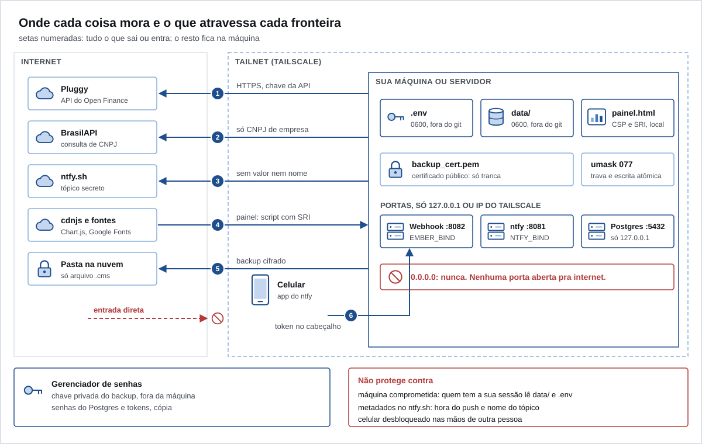

# Segurança

O Ember lida com o seu extrato inteiro. Esta página diz onde cada coisa mora, o que atravessa cada fronteira, o que está protegido e o que não está.



## As zonas

| Zona | O que tem | Em quem você confia |
|---|---|---|
| Internet | Pluggy, BrasilAPI, ntfy.sh, cdnjs, Google Fonts, a pasta de backup na nuvem | em cada serviço, só pro que ele precisa ver |
| Tailnet (Tailscale) | o celular e o servidor em casa | nos seus aparelhos e na conta do Tailscale |
| Sua máquina ou servidor | `.env`, `data/`, `painel.html`, o certificado do backup, as portas locais | no seu usuário do sistema |
| Fora de tudo | a chave privada do backup, no gerenciador de senhas | no gerenciador |

## O que sai da máquina, e pra onde

| # | Destino | O que vai | O que não vai |
|---|---|---|---|
| 1 | Pluggy | HTTPS com o `CLIENT_ID` e o `CLIENT_SECRET`, os itemIds | nada seu além disso; o extrato vem de lá |
| 2 | BrasilAPI | o CNPJ de empresas da sua zona cinza | CPF, valor, data |
| 3 | ntfy | tipo do alerta, quantos, nível | valor, nome de loja, de pessoa, de cartão ou de banco |
| 4 | cdnjs, Google Fonts | o pedido do Chart.js e das fontes, quando você abre o painel | o seu dado: a página não faz nenhuma outra conexão |
| 5 | pasta de backup | um `.cms` cifrado | nada em claro |
| 6 | webhook (entrando) | `acao:chave` do botão, com token | valor, nome |

## Como cada coisa é protegida

### Segredos e arquivos

- Segredos só no `.env`, com permissão 0600. O `.env` está no `.gitignore`.
- Todo script chama `umask 077`: o que ele cria em `data/` nasce só pro dono. Isso vale pros scripts filhos da rotina.
- `data/` inteiro está no `.gitignore`: extrato, regras, cadastro, painel, logs.
- A chave privada do backup nunca fica na máquina. Veja [08-backup.md](08-backup.md).
- Recomendado: disco cifrado (FileVault no macOS, LUKS no Linux). O Ember não cifra `data/` em repouso.

### Rede

- Nenhuma porta abre pra internet. Postgres escuta só em `127.0.0.1`; ntfy próprio e webhook, em `127.0.0.1` ou no IP do Tailscale. `0.0.0.0` nunca.
- Toda chamada de rede tem tempo limite: 30 segundos pra Pluggy, BrasilAPI, ntfy e TickTick; 5 segundos por conexão no webhook.
- Dentro da tailnet o tráfego vai cifrado pelo WireGuard do Tailscale.

### Push e botões

- O texto do push não leva valor nem nome. Ele passa pelo ntfy e aparece na tela bloqueada.
- No ntfy.sh público, o tópico é o segredo e cada botão leva uma assinatura HMAC-SHA256. Resposta sem assinatura válida é ignorada. O token nunca vai pro ntfy.sh.
- Toda resposta só vale pra uma chave que existe em `data/alertas.json`, com formato fixo e até 20 chaves por toque.
- O estado dos alertas é gravado de forma atômica (temporário, `fsync` e troca) e sob trava de arquivo, porque dois processos escrevem nele.

### Webhook

- Não sobe sem `ALERTA_WEBHOOK_TOKEN` de 32 caracteres ou mais.
- Token comparado em tempo constante.
- Só `POST /alerta`, `Content-Length` obrigatório, até 256 bytes.
- IP que erra o token 5 vezes fica bloqueado 1 minuto; cada nova rodada de erros dobra o bloqueio, até 1 hora.
- Resposta sem detalhe. O log não guarda o corpo do pedido. Erro de um passo da rotina vai pra `data/logs/`, com permissão 0600, e o log do contêiner diz só o script e o código.

### Dado que vem de fora

A API é tratada como entrada não confiável.

- `PLUGGY_ITEM_IDS` é validado (rótulo e UUID) antes de qualquer chamada.
- Transação sem `id` ou `date` em texto, ou com valor que não é número finito, é descartada com aviso.
- O campo `next` da paginação só é aceito como query string simples; qualquer outra coisa (outro host, outro caminho) encerra a paginação daquela conta.
- O CNAE da BrasilAPI só vira regra se for só dígitos.
- Os seus dois JSON pessoais são validados por completo a cada rodada.
- A carga do Postgres escapa todo texto (a descrição de um Pix é escrita por quem manda o dinheiro), remove o byte nulo e recusa número não finito.

### Painel

- Content Security Policy com o hash do único script inline, calculado a cada montagem. Sem `'unsafe-inline'` pra script.
- Chart.js com Subresource Integrity.
- `connect-src 'none'`: a página não manda nada pra lugar nenhum.
- Todo texto de fora passa por escape antes de entrar no HTML.
- É um arquivo local. Nunca publique. Veja [05-painel.md](05-painel.md#nunca-publique-o-painel).

### Servidor

- Contêiner dos scripts roda sem root.
- Imagens com versão fixa; o Dependabot propõe atualização toda semana.
- Postgres com papéis de menor privilégio prontos pra ligar (`sql/0005_papeis.sql`).
- No n8n, `N8N_BLOCK_ENV_ACCESS_IN_NODE=false` abre o ambiente pros nós de código. Veja [07-servidor-em-casa.md](07-servidor-em-casa.md#n8n-alternativa-de-carga).

### Repositório e CI

- Actions do GitHub fixadas por SHA, com `permissions: contents: read` e `persist-credentials: false`.
- `gitleaks` procura segredo em todo o histórico a cada push.
- A trava de dado pessoal (`tools/checar_dados_pessoais.py`) roda no CI. Veja [10-desenvolver.md](10-desenvolver.md).
- Os scripts só usam a biblioteca padrão do Python. Não há dependência de terceiros pra atualizar ou auditar.

## O que não está protegido

- **Máquina comprometida.** Quem roda código com o seu usuário lê `data/` e `.env`. Permissão de arquivo não protege contra você mesmo.
- **Metadados no ntfy.sh.** O serviço vê a hora de cada push, o nome do tópico e o seu IP. Quem descobrir o tópico lê os pushes (sem valor nem nome, mas sabe que você tem uma fatura vencida). Com ntfy próprio isso some.
- **A Pluggy vê o seu extrato.** Ela é o agregador. Confiar nela é parte do desenho.
- **A BrasilAPI vê os CNPJs consultados.** Isso revela empresas onde você compra, ainda que sem valor nem data.
- **Celular desbloqueado.** Quem tem o seu celular aberto toca nos botões.
- **Atraso da Pluggy.** A compra estranha pode ser avisada até 24 h depois. O bloqueio na hora é o app do banco.
- **`data/` em repouso.** Sem disco cifrado, um disco roubado entrega o seu dado.
- **Escrita concorrente.** Só o estado dos alertas tem trava. Não rode duas rotinas ao mesmo tempo na mesma pasta.

## Antes de ligar o webhook

- [ ] `ALERTA_WEBHOOK_TOKEN` gerado com `python3 -c "import secrets;print(secrets.token_urlsafe(36))"`, só no `.env`, com o `.env` em 0600.
- [ ] `EMBER_BIND` é o IP do servidor no Tailscale (`tailscale ip -4`). Nunca `0.0.0.0`.
- [ ] A porta só escuta nesse IP. No Linux: `ss -ltn | grep 8082`. No macOS: `lsof -nP -iTCP:8082 -sTCP:LISTEN`.
- [ ] Nenhum redirecionamento de porta no roteador, e nenhum Tailscale Funnel pra 8082 (`tailscale funnel status`).
- [ ] O ntfy é próprio (`ALERTA_WEBHOOK_URL` só vale com ele), com `deny-all` e token.
- [ ] Um pedido com token errado recebe 403:

  ```sh
  curl -s -o /dev/null -w '%{http_code}\n' -X POST -H 'Authorization: Bearer errado' \
    --data 'ignorar:teste' http://<IP do Tailscale>:8082/alerta
  ```

  Repetido 5 vezes, o seguinte recebe 429.
- [ ] O log do contêiner mostra `webhook dos botoes em <IP>:8082`.
- [ ] Se quiser ir além: uma ACL no Tailscale que só deixa o celular chegar na porta 8082.
- [ ] Se o token vazar: troque no `.env` e reinicie o contêiner. Os botões dos pushes antigos param de funcionar.

## Relatar uma falha

Veja [SECURITY.md](../SECURITY.md).

Próximo: [10-desenvolver.md](10-desenvolver.md).
